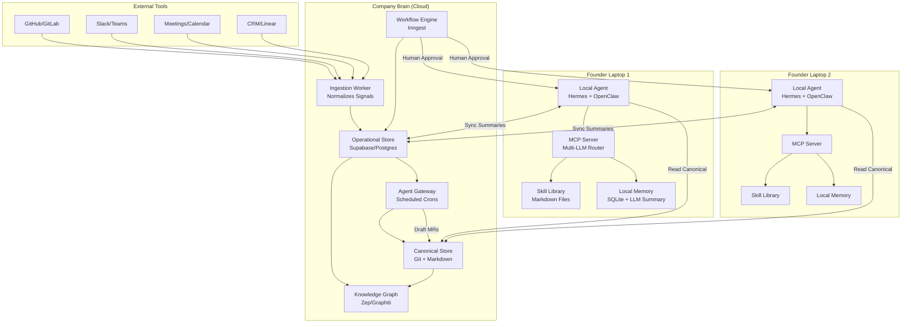

# NabhiPersona: AI-Native Company Operating System
## Comprehensive Architecture & Implementation Report

**Date:** August 14, 2026  
**Version:** 1.0  
**Audience:** Technical cofounders, implementation team

***

## 1. Executive Summary

NabhiPersona is an AI-native company operating system with two core components: a **Local Autonomous Agent** running on each founder's laptop (like a personal Jarvis) and a **Company Brain** in the cloud that preserves organizational memory. This architecture enables founders to delegate complex workflows to AI while maintaining human oversight and building compounding institutional knowledge.

**Key Research Findings:**
- **Computer-use agents are production-ready in 2026**: OpenClaw, Hermes Agent, and Open Interpreter can reliably control laptops, browse, execute code, and use applications with proper approval gates [milvus](https://milvus.io/blog/openclaw-formerly-clawdbot-moltbot-explained-a-complete-guide-to-the-autonomous-ai-agent.md)
- **Temporal knowledge graphs outperform vector-only memory**: Zep/Graphiti achieves 94.8% accuracy on long-term memory retrieval vs 93.4% for MemGPT, with 90% lower latency, because it tracks both event time and ingestion time for every fact [arxiv](https://arxiv.org/abs/2501.13956)
- **Durable execution is non-negotiable**: Temporal and Inngest prevent workflow failures from crashes, network issues, or long-running tasks by journaling every step and replaying from checkpoints [temporal](https://temporal.io/blog/what-is-durable-execution)
- **Human-in-the-loop prevents corruption**: Research shows AI agents silently corrupt documents over ~20 interactions if allowed to update them directly; the fix is AI proposes drafts, humans promote to canonical truth [swiftcns](https://swiftcns.ai/blog/ai-native-company-brain/)

**Major Recommendations:**
1. **Build on Hermes Agent + OpenClaw** for local agents (MIT-licensed, self-improving, multi-model, 46K+ GitHub stars) [tosea](https://tosea.ai/blog/hermes-agent-self-improving-ai-guide)
2. **Use LangGraph for orchestration** (stateful graphs, best observability, production-proven at scale) [datacamp](https://www.datacamp.com/tutorial/crewai-vs-langgraph-vs-autogen)
3. **Adopt Zep/Graphiti for Company Brain memory** (temporal knowledge graph with bitemporal modeling for decision provenance) [emergentmind](https://www.emergentmind.com/topics/zep-a-temporal-knowledge-graph-architecture)
4. **Use Inngest for workflow engine** (lighter than Temporal, TypeScript-native, durable execution, human approval support) [vectorize](https://vectorize.io/articles/mem0-vs-zep)
5. **Follow the "dual memory" pattern**: Git + Markdown for canonical truth, Postgres for operational signals, with human promotion gates [swiftcns](https://swiftcns.ai/blog/ai-native-company-brain/)

***

## 2. Refined System Concept

### Improvements to Initial Idea

Your original concept is strong but missing critical components identified through research:

| Missing Component | Why It Matters | Solution |
|------------------|----------------|----------|
| **Ingestion Worker** | Raw signals from tools (Slack, GitHub, meetings) are messy and incompatible; agents need normalized events  [swiftcns](https://swiftcns.ai/blog/ai-native-company-brain/) | Dedicated service that polls/catches webhooks, normalizes to unified schema, writes to operational store every 10 minutes |
| **Dual Memory Architecture** | Storing everything in one place causes Git bloat (high-frequency events) or loses auditability (DB-only)  [zenml](https://www.zenml.io/blog/temporal-alternatives) | Git + Markdown for canonical truth (decisions, docs); Postgres for signals, agent state, recent events |
| **Trust Tiers** | Enabling full autonomy too early leads to unread draft piles and lost trust  [swiftcns](https://swiftcns.ai/blog/ai-native-company-brain/) | Tier 0 (observe only) → Tier 1 (propose drafts) → Tier 2 (low-risk automations), with KPI gates |
| **Skill Persistence Layer** | Stateless agents waste tokens re-explaining context every session  [tosea](https://tosea.ai/blog/hermes-agent-self-improving-ai-guide) | Auto-generated Markdown skill files (Hermes pattern) + Company Brain retrieval |
| **Agent Gateway** | Always-on agents need scheduled crons that read operational store, draft outputs, open merge requests  [swiftcns](https://swiftcns.ai/blog/ai-native-company-brain/) | Separate from ingestion worker; runs on OpenClaw/Hermes host with disabled-by-default crons |

### Clear Definitions and Boundaries

**Local Autonomous Agent:**
- Runs on founder's laptop (or VPS like Railway/Render)
- Controls that laptop only (not other founders' machines)
- Uses MCP (Model Context Protocol) to connect to multiple LLMs (Claude, Cursor, Codex, Perplexity) [tosea](https://tosea.ai/blog/hermes-agent-self-improving-ai-guide)
- Syncs **summaries, decisions, completed workflows** to Company Brain, not raw screen recordings or keystrokes
- Asks for approval before: sensitive file operations, external API calls with credentials, code deploys, large expenses

**Company Brain:**
- Private cloud deployment (Supabase or self-hosted Postgres + pgvector)
- Stores: normalized events, agent run logs, canonical documents (Git-backed), knowledge graph entities/relationships
- Answers temporal queries: "Why was this decision made on date X?", "Who did what in week Y?", "What was the context at that time?"
- Coordinates multiple local agents via shared memory, not direct control

**Boundaries:**
- Local agents do **not** directly control each other (peer-to-peer chaos)
- Company Brain does **not** execute workflows (orchestration happens locally)
- High-frequency events (every Slack message) stay in operational store; only promoted summaries go to Git [swiftcns](https://swiftcns.ai/blog/ai-native-company-brain/)

***

## 3. High-Level Architecture

### Component Diagram

### Component Descriptions

| Component | Technology | Responsibility |
|-----------|------------|----------------|
| **Local Agent** | Hermes Agent + OpenClaw | Executes workflows on laptop, controls apps/browser, asks for approvals, syncs to Company Brain  [tosea](https://tosea.ai/blog/hermes-agent-self-improving-ai-guide) |
| **MCP Server** | GBrain MCP or custom | Routes requests to multiple LLMs (Claude, Cursor, Codex, Perplexity), manages API keys, enforces rate limits  [zenml](https://www.zenml.io/blog/temporal-alternatives) |
| **Skill Library** | Markdown files (Hermes pattern) | Auto-generated reusable skills from completed tasks, loaded contextually to avoid token bloat  [tosea](https://tosea.ai/blog/hermes-agent-self-improving-ai-guide) |
| **Local Memory** | SQLite + LLM summarization | Cross-session memory for that founder's laptop, full-text searchable, ~50K page capacity  [zenml](https://www.zenml.io/blog/temporal-alternatives) |
| **Ingestion Worker** | Node.js/TypeScript service | Polls webhooks from GitHub, Slack, meetings, CRM; normalizes to unified event schema; writes to OpStore every 10 min  [swiftcns](https://swiftcns.ai/blog/ai-native-company-brain/) |
| **Operational Store** | Supabase (Postgres + pgvector) | Normalized events, agent run logs, recent signals, dedupe keys, time-window queries  [swiftcns](https://swiftcns.ai/blog/ai-native-company-brain/) |
| **Canonical Store** | GitLab/GitHub + Markdown | Living truth: decisions, architecture docs, policies. AI proposes drafts via MR; humans merge to promote  [swiftcns](https://swiftcns.ai/blog/ai-native-company-brain/) |
| **Knowledge Graph** | Zep/Graphiti (temporal KG) | Entities (people, companies, decisions), relationships (works_at, decided_by, referenced_in), bitemporal modeling  [emergentmind](https://www.emergentmind.com/topics/zep-a-temporal-knowledge-graph-architecture) |
| **Workflow Engine** | Inngest | Durable execution for long-running workflows, human approval steps, retries, observability  [vectorize](https://vectorize.io/articles/mem0-vs-zep) |
| **Agent Gateway** | OpenClaw crons or Inngest schedules | Reads OpStore overnight, drafts summaries/standups, opens MRs to Canonical Store  [swiftcns](https://swiftcns.ai/blog/ai-native-company-brain/) |

### Data Flow

1. **Signals → Ingestion**: GitHub PRs, Slack threads, meeting transcripts, CRM updates → Ingestion Worker normalizes → OpStore [swiftcns](https://swiftcns.ai/blog/ai-native-company-brain/)
2. **OpStore → Agents**: Local agents query OpStore for recent context + Canonical Store for living truth [zenml](https://www.zenml.io/blog/temporal-alternatives)
3. **Agents → Drafts**: Agents draft summaries, decisions, action items → Open MRs to Canonical Store [swiftcns](https://swiftcns.ai/blog/ai-native-company-brain/)
4. **Humans → Promote**: Founders review MRs, merge to `living` status → Sync back to OpStore for next cycle [swiftcns](https://swiftcns.ai/blog/ai-native-company-brain/)
5. **OpStore → KG**: Entities/relationships extracted → Zep/Graphiti builds temporal graph with validity windows [emergentmind](https://www.emergentmind.com/topics/zep-a-temporal-knowledge-graph-architecture)

### Control Flow

- **Local agents** are autonomous for Tier 0 (observe/summarize) and Tier 1 (draft proposals)
- **Workflow Engine** gates Tier 2 (execute automations) with human approval steps
- **Company Brain** coordinates via shared memory, not direct commands (agents pull, not pushed)

***

## 4. Landscape Scan and Comparisons

### 4.1 Local Autonomous Agents / Computer-Use Agents

| System | Capabilities | Computer Control | Planning | Permissions | Memory | Open Source | Multi-LLM | Security | Limitations |
|--------|-------------|------------------|----------|-------------|--------|-------------|-----------|----------|-------------|
| **Hermes Agent**  [tosea](https://tosea.ai/blog/hermes-agent-self-improving-ai-guide) | Research, code, cron jobs, subagents, voice | CLI + browser automation (via tools) | Self-improving skill loop, Honcho user modeling | Asks before sensitive actions | SQLite + LLM summary, auto-generated Markdown skills | ✅ MIT | ✅ 200+ models via OpenRouter | Runs on your infra, data stays local | No native GUI control (needs tools) |
| **OpenClaw**  [milvus](https://milvus.io/blog/openclaw-formerly-clawdbot-moltbot-explained-a-complete-guide-to-the-autonomous-ai-agent.md) | Shell commands, browser, email, calendar, files | Full OS control (cross-platform) | Tool-RAG (117 tools, retrieves relevant per turn) | Configurable approval gates | ClawHub skill marketplace | ✅ MIT | ✅ Multi-provider | Self-hosted, audit logs | Chat-driven (not IDE-native) |
| **Open Interpreter**  [github](https://github.com/garrytan/gbrain) | Code execution, file edits, browser automation | Terminal + vision-based GUI control | Operator mode (v0.4.x) for OS-level tasks | Sandboxed modes (read-only, workspace, full) | Session-based, optional memory | ✅ MIT | ✅ Any OpenAI-compatible | Sandboxing, offline mode | Stateless by default (needs add-ons) |
| **Self-Operating Computer**  [emergent](https://emergent.sh/learn/what-is-openclaw) | Screen interpretation, mouse/keyboard actions | Multimodal (GPT-4V, Claude 3, Gemini) | SoM prompting for visual grounding | Manual approval | None built-in | ✅ MIT | ❌ Vision models only | Local execution | No memory, no skill persistence |
| **Cursor Agent Mode**  [youtube](https://www.youtube.com/watch?v=NJ5J2L65Kgc) | Code generation, refactoring, testing | IDE-scoped (VS Code) | Single editor loop with approval gates | Explicit approval per action | Project context only | ❌ Commercial | ✅ Multiple models | Scoped to workspace | Not general computer control |
| **AutoGPT / BabyAGI**  [youtube](https://www.youtube.com/watch?v=NJ5J2L65Kgc) | Task decomposition, tool use | Limited (browser, shell) | Basic planning loops | Minimal | Vector DB (lossy) | ✅ MIT | ✅ Multi-model | Weak (no sandboxing) | ❌ Unreliable for real work  [youtube](https://www.youtube.com/watch?v=NJ5J2L65Kgc) |

**Recommendation:** **Hermes Agent + OpenClaw** for local agents. Hermes provides self-improving skills and cross-session memory; OpenClaw provides broad OS control and ClawHub skill marketplace. Both are MIT-licensed, run on your infra, and integrate via MCP. [milvus](https://milvus.io/blog/openclaw-formerly-clawdbot-moltbot-explained-a-complete-guide-to-the-autonomous-ai-agent.md)

### 4.2 Multi-Agent Orchestration Frameworks

| Framework | Programming Model | State Management | Tool Calling | Human-in-the-Loop | Observability | Local + Cloud Hybrid | Best For |
|-----------|------------------|------------------|--------------|-------------------|---------------|---------------------|----------|
| **LangGraph**  [datacamp](https://www.datacamp.com/tutorial/crewai-vs-langgraph-vs-autogen) | Stateful graphs (nodes = agents/steps) | ✅ Explicit graph state, checkpointing | ✅ Native function calling | ✅ Human nodes, approval steps | ✅ LangSmith integration, trace-level | ✅ Graph can span local/cloud | Production workflows needing control + observability |
| **CrewAI**  [datacamp](https://www.datacamp.com/tutorial/crewai-vs-langgraph-vs-autogen) | Role-based (Agent = role + task) | ⚠️ Implicit (task chain) | ✅ Tool delegation | ⚠️ Manual callbacks | ⚠️ Basic logging | ⚠️ Single-process (hard to split) | Quick prototypes, role-based collaboration |
| **AutoGen**  [datacamp](https://www.datacamp.com/tutorial/crewai-vs-langgraph-vs-autogen) | Conversation-driven (agents chat) | ⚠️ Chat history as state | ✅ Tool execution | ⚠️ Manual interrupts | ⚠️ Limited | ⚠️ Tightly coupled | Multi-agent dialogue, iterative refinement |
| **OpenAI Agents SDK**  [promptquorum](https://www.promptquorum.com/power-local-llm/autonomous-local-agents-actually-work) | Handoffs + guardrails | ✅ Traces + handoff state | ✅ Native | ✅ Human handoff | ✅ Traces dashboard | ❌ Cloud-only (OpenAI infra) | OpenAI-native deployments |
| **Microsoft Agent Framework**  [alicelabs](https://alicelabs.ai/en/insights/best-ai-agent-frameworks-2026) | .NET workflows | ✅ Stateful | ✅ Semantic Kernel tools | ✅ Approval steps | ✅ Application Insights | ✅ Hybrid | Enterprise .NET stacks |
| **Google ADK** | Task graphs | ✅ Session state | ✅ Tool registry | ⚠️ Limited | ✅ Cloud Logging | ⚠️ GCP-centric | Google Cloud deployments |

**Recommendation:** **LangGraph** for orchestration. It provides explicit state management (critical for durable workflows), human approval nodes, best observability (LangSmith), and can span local + cloud boundaries. CrewAI is a close second for rapid prototyping but lacks fine-grained control. [datacamp](https://www.datacamp.com/tutorial/crewai-vs-langgraph-vs-autogen)

### 4.3 Long-Term Organizational Memory Systems

| System | Architecture | Temporal Modeling | Retrieval Accuracy | Open Source | Self-Host | Best For |
|--------|-------------|-------------------|-------------------|-------------|-----------|----------|
| **Zep / Graphiti**  [arxiv](https://arxiv.org/abs/2501.13956) | Temporal knowledge graph (episodic + semantic + community subgraphs) | ✅ Bitemporal (event time + ingestion time) | 94.8% DMR, +18.5% LongMemEval | ✅ Graphiti open | ✅ Via Graphiti | Decision provenance, audit trails, changing facts |
| **Letta (MemGPT)**  [langfuse](https://langfuse.com/blog/2025-03-19-ai-agent-comparison) | Tiered memory (core, recall, archival) | ⚠️ Session-based tiers | 93.4% DMR | ✅ Apache 2.0 | ✅ Yes | Stateful agent runtime, OS-inspired memory |
| **Mem0**  [codex.danielvaughan](https://codex.danielvaughan.com/2026/04/18/git-backed-team-memory-egregore-codex-hooks/) | Vector DB + Knowledge Graph (dual-store) | ❌ No native temporal model | 49.0% LongMemEval (independent) | ✅ Apache 2.0 | ✅ Yes | Personalization, user-specific memory |
| **Cognee**  [vectorize](https://vectorize.io/articles/mem0-vs-letta) | Graph + vector hybrid | ⚠️ Basic versioning | Not benchmarked | ✅ MIT | ✅ Yes | Multi-tenant knowledge graphs |
| **Pinecone / Qdrant** | Vector-only | ❌ None | Baseline | ⚠️ Qdrant open | ✅ Qdrant | Simple semantic search, no relationships |
| **Event Sourcing + Postgres**  [mem0](https://mem0.ai/blog/mem0-vs-zep) | Append-only event log + projections | ✅ Bitemporal (SQL:2011 standard) | N/A (exact match) | ✅ Postgres open | ✅ Yes | Audit trails, regulatory compliance, exact reconstruction |

**Recommendation:** **Zep/Graphiti** for Company Brain memory. Its temporal knowledge graph with bitemporal modeling (event time + ingestion time) is purpose-built for decision provenance and audit trails, outperforming vector-only and tiered memory on long-term retrieval. Pair with **Git + Markdown** for canonical truth (human-promoted documents). [arxiv](https://arxiv.org/abs/2501.13956)

### 4.4 Workflow Engines / Durable Execution

| Engine | Language | Durable Execution | Human Approval | Long-Running | Observability | Local + Cloud | Best For |
|--------|---------|-------------------|----------------|--------------|---------------|---------------|----------|
| **Inngest**  [vectorize](https://vectorize.io/articles/mem0-vs-zep) | TypeScript | ✅ Serverless durable functions | ✅ `waitForApproval()` steps | ✅ Hours/days | ✅ Dashboard + traces | ✅ Edge + cloud | TypeScript-native, lightweight workflows |
| **Temporal**  [temporal](https://temporal.io/blog/what-is-durable-execution) | Multi-language | ✅ History-based replay | ⚠️ Manual signals | ✅ Months/years | ✅ Web UI + metrics | ✅ Hybrid | Mission-critical, long-running workflows |
| **n8n**  [colrows](https://colrows.com/blogs/enterprise-memory-graph/) | Visual (node-based) | ✅ Checkpointed executions | ✅ Manual approval nodes | ⚠️ Minutes/hours | ✅ Execution logs | ⚠️ Self-host only | Visual workflows, non-technical users |
| **Windmill**  [colrows](https://colrows.com/blogs/enterprise-memory-graph/) | Scripts → workflows | ✅ Persistent state | ⚠️ Manual | ✅ Hours | ✅ Run history | ✅ Self-host | Code-first internal tools |
| **Prefect** | Python | ✅ Stateful runs | ⚠️ Manual | ✅ Hours | ✅ Dashboard | ✅ Hybrid | Data pipelines, ML workflows |
| **Camunda** | BPMN 2.0 | ✅ Process engine | ✅ Human tasks | ✅ Months | ✅ Cockpit | ⚠️ Enterprise | BPMN-heavy enterprises |

**Recommendation:** **Inngest** for MVP. It's TypeScript-native (matches Hermes/LangGraph stack), provides durable execution with human approval steps, lighter than Temporal, and has excellent observability. Upgrade to Temporal if workflows need to run for months or require multi-language support. [vectorize](https://vectorize.io/articles/mem0-vs-zep)

***

## 5. Recommended Technology Stack for MVP

### Local Agent Runtime
- **Primary:** Hermes Agent (MIT, self-improving, 200+ models, SQLite memory) [tosea](https://tosea.ai/blog/hermes-agent-self-improving-ai-guide)
- **Secondary:** OpenClaw (for broader OS control, ClawHub skills) [milvus](https://milvus.io/blog/openclaw-formerly-clawdbot-moltbot-explained-a-complete-guide-to-the-autonomous-ai-agent.md)
- **MCP Server:** GBrain MCP (30+ tools, OAuth 2.1, remote + local) [zenml](https://www.zenml.io/blog/temporal-alternatives)
- **Local Memory:** SQLite + LLM summarization (Hermes default) [tosea](https://tosea.ai/blog/hermes-agent-self-improving-ai-guide)

### Orchestration Layer
- **Framework:** LangGraph 1.x (stateful graphs, human nodes, LangSmith observability) [alicelabs](https://alicelabs.ai/en/insights/best-ai-agent-frameworks-2026)
- **State Store:** Postgres (checkpointing, durable state) [datacamp](https://www.datacamp.com/tutorial/crewai-vs-langgraph-vs-autogen)
- **Tool Registry:** LangChain tools + custom MCP tools [promptquorum](https://www.promptquorum.com/power-local-llm/autonomous-local-agents-actually-work)

### Memory and Knowledge Storage
- **Company Brain (Operational):** Supabase (Postgres + pgvector, zero-config, scales to 100K+ pages) [swiftcns](https://swiftcns.ai/blog/ai-native-company-brain/)
- **Company Brain (Canonical):** GitLab/GitHub + Markdown (versioned, human-promoted) [swiftcns](https://swiftcns.ai/blog/ai-native-company-brain/)
- **Knowledge Graph:** Zep/Graphiti (temporal KG, bitemporal modeling) [emergentmind](https://www.emergentmind.com/topics/zep-a-temporal-knowledge-graph-architecture)
- **Local Memory:** SQLite (Hermes default, full-text search) [tosea](https://tosea.ai/blog/hermes-agent-self-improving-ai-guide)

### Cloud Brain Backend
- **Hosting:** Railway or Render (zero-config, scales with usage, ~$25-75/month for <20 users) [swiftcns](https://swiftcns.ai/blog/ai-native-company-brain/)
- **Database:** Supabase (managed Postgres + pgvector, free tier, then ~$25/month) [zenml](https://www.zenml.io/blog/temporal-alternatives)
- **API Gateway:** FastAPI or Express (MCP-compatible, OAuth 2.1) [zenml](https://www.zenml.io/blog/temporal-alternatives)
- **File Storage:** Supabase Storage or S3 (for attachments, screen recordings) [swiftcns](https://swiftcns.ai/blog/ai-native-company-brain/)

### Workflow Engine
- **Primary:** Inngest (TypeScript, durable execution, human approval, serverless) [vectorize](https://vectorize.io/articles/mem0-vs-zep)
- **Alternative:** Temporal (if workflows need months-long execution) [temporal](https://temporal.io/blog/what-is-durable-execution)

### Security/Auth Approach
- **Authentication:** OAuth 2.1 with PKCE (required for ChatGPT, Perplexity, Claude Desktop) [zenml](https://www.zenml.io/blog/temporal-alternatives)
- **Authorization:** Scope-gated access (read/write/admin scopes per agent) [zenml](https://www.zenml.io/blog/temporal-alternatives)
- **Secrets Management:** Supabase Vault or AWS Secrets Manager (never in Git) [temporal](https://temporal.io/)
- **Audit Logs:** Append-only event log in Postgres (immutable, tamper-proof) [mem0](https://mem0.ai/blog/mem0-vs-zep)
- **Data Isolation:** Per-user row-level security (RLS) in Supabase, scoped queries [zenml](https://www.zenml.io/blog/temporal-alternatives)

***

## 6. Build vs Buy vs Reuse Decisions

| Component | Recommendation | Rationale | Trade-offs |
|-----------|---------------|-----------|------------|
| **Local Agent Runtime** | ✅ Reuse (Hermes + OpenClaw) | MIT-licensed, production-proven (46K+ stars, 346 contributors), self-improving skills, multi-model  [tosea](https://tosea.ai/blog/hermes-agent-self-improving-ai-guide) | Less control over core loop; must follow their upgrade path |
| **MCP Server** | ✅ Reuse (GBrain MCP) | 30+ tools out-of-box, OAuth 2.1, remote + local, thin-client support  [zenml](https://www.zenml.io/blog/temporal-alternatives) | Tied to GBrain schema; custom tools require skillpack authoring |
| **Orchestration** | ✅ Reuse (LangGraph) | Best-in-class state management, human nodes, LangSmith observability, production at scale  [alicelabs](https://alicelabs.ai/en/insights/best-ai-agent-frameworks-2026) | Learning curve for graph-based programming |
| **Memory (Operational)** | ✅ Reuse (Supabase) | Zero-config Postgres + pgvector, RLS for multi-tenant, free tier, scales to 100K+ pages  [zenml](https://www.zenml.io/blog/temporal-alternatives) | Vendor lock-in (but Postgres is portable) |
| **Memory (Canonical)** | ✅ Build (Git + Markdown) | Human-promoted truth, audit trail via Git history, agent-readable  [swiftcns](https://swiftcns.ai/blog/ai-native-company-brain/) | Requires discipline to maintain folder taxonomy |
| **Knowledge Graph** | ✅ Reuse (Zep/Graphiti) | Bitemporal modeling, 94.8% DMR accuracy, purpose-built for decision provenance  [emergentmind](https://www.emergentmind.com/topics/zep-a-temporal-knowledge-graph-architecture) | Self-host Graphiti (managed Zep is $249/mo for graph features)  [codex.danielvaughan](https://codex.danielvaughan.com/2026/04/18/git-backed-team-memory-egregore-codex-hooks/) |
| **Workflow Engine** | ✅ Reuse (Inngest) | TypeScript-native, durable execution, human approval, lighter than Temporal  [vectorize](https://vectorize.io/articles/mem0-vs-zep) | Less mature than Temporal for month-long workflows |
| **Ingestion Worker** | ⚠️ Build (on n8n/Windmill) | Normalize signals from GitHub, Slack, meetings, CRM to unified schema  [swiftcns](https://swiftcns.ai/blog/ai-native-company-brain/) | Can start with n8n visual workflows, migrate to custom later |
| **Agent Gateway** | ⚠️ Build (OpenClaw crons) | Scheduled crons that read OpStore, draft summaries, open MRs  [swiftcns](https://swiftcns.ai/blog/ai-native-company-brain/) | Can use OpenClaw's built-in cron scheduler initially |
| **Auth/OAuth** | ✅ Reuse (Supabase Auth + OAuth 2.1) | PKCE support, scope-gated access, RLS integration  [zenml](https://www.zenml.io/blog/temporal-alternatives) | Must configure OAuth clients for each LLM provider |

**What to Avoid:**
- ❌ **AutoGPT/BabyAGI**: Unreliable for real work, fail in different ways [youtube](https://www.youtube.com/watch?v=NJ5J2L65Kgc)
- ❌ **Vector-only memory (Pinecone)**: Loses relationships, no temporal reasoning [composio](https://composio.dev/content/secure-ai-agent-infrastructure-guide)
- ❌ **Notion/Google Docs as canonical store**: Weak agent write loop, poor audit story at scale [swiftcns](https://swiftcns.ai/blog/ai-native-company-brain/)
- ❌ **Monolithic "do everything" agent**: Specialized agents (maintenance, orchestration, workflow) outperform generic assistants [swiftcns](https://swiftcns.ai/blog/ai-native-company-brain/)

***

## 7. Phased Roadmap

### Phase 0: Core Prototype (Weeks 1-4)
**Goal:** Prove local agent + Company Brain sync works for 4 cofounders

**Deliverables:**
- [ ] Hermes Agent installed on each founder's laptop (with OpenClaw for OS control) [milvus](https://milvus.io/blog/openclaw-formerly-clawdbot-moltbot-explained-a-complete-guide-to-the-autonomous-ai-agent.md)
- [ ] GBrain MCP server running locally (PGLite, zero-config) [zenml](https://www.zenml.io/blog/temporal-alternatives)
- [ ] Supabase project set up (operational store) [swiftcns](https://swiftcns.ai/blog/ai-native-company-brain/)
- [ ] GitLab repo created (canonical store with `draft`/`living`/`archived` folders) [swiftcns](https://swiftcns.ai/blog/ai-native-company-brain/)
- [ ] Ingestion worker: GitHub + Slack webhooks → Supabase (normalized events) [swiftcns](https://swiftcns.ai/blog/ai-native-company-brain/)
- [ ] One orchestration agent: Daily standup digest (reads OpStore, drafts to Git) [swiftcns](https://swiftcns.ai/blog/ai-native-company-brain/)
- [ ] Human promotion ritual: Founders review/merge MRs weekly [swiftcns](https://swiftcns.ai/blog/ai-native-company-brain/)

**Key Tasks:**
1. Install Hermes on all laptops (30 min each) [tosea](https://tosea.ai/blog/hermes-agent-self-improving-ai-guide)
2. Deploy GBrain with PGLite (2 seconds, no server) [zenml](https://www.zenml.io/blog/temporal-alternatives)
3. Set up Supabase project + RLS policies (1 hour) [swiftcns](https://swiftcns.ai/blog/ai-native-company-brain/)
4. Create GitLab repo with folder taxonomy (30 min) [swiftcns](https://swiftcns.ai/blog/ai-native-company-brain/)
5. Write ingestion worker (Node.js, 2-3 hours) [swiftcns](https://swiftcns.ai/blog/ai-native-company-brain/)
6. Configure daily standup cron (OpenClaw, 1 hour) [swiftcns](https://swiftcns.ai/blog/ai-native-company-brain/)
7. Run first weekly promotion meeting (1 hour) [swiftcns](https://swiftcns.ai/blog/ai-native-company-brain/)

**Success Criteria:**
- All 4 founders can query Company Brain and get synthesized answers with citations [zenml](https://www.zenml.io/blog/temporal-alternatives)
- Daily standup drafts are generated overnight, reviewed/merged weekly [swiftcns](https://swiftcns.ai/blog/ai-native-company-brain/)
- Zero data leaks between founders (RLS tested) [zenml](https://www.zenml.io/blog/temporal-alternatives)

### Phase 1: Reliable Daily Workflows (Weeks 5-12)
**Goal:** Automate 3-5 high-value workflows with human approval

**Deliverables:**
- [ ] LangGraph orchestration layer (stateful graphs, checkpointing) [alicelabs](https://alicelabs.ai/en/insights/best-ai-agent-frameworks-2026)
- [ ] Zep/Graphiti knowledge graph (entities: people, companies, decisions) [emergentmind](https://www.emergentmind.com/topics/zep-a-temporal-knowledge-graph-architecture)
- [ ] Inngest workflow engine (durable execution, human approval steps) [vectorize](https://vectorize.io/articles/mem0-vs-zep)
- [ ] 3 specialist agents:
  - Maintenance: Refresh architecture docs from codebase weekly [swiftcns](https://swiftcns.ai/blog/ai-native-company-brain/)
  - Orchestration: Weekly status report + decisions queue [swiftcns](https://swiftcns.ai/blog/ai-native-company-brain/)
  - Workflow: Meeting notes → action items → Linear tickets [swiftcns](https://swiftcns.ai/blog/ai-native-company-brain/)
- [ ] Trust Tier 1 enabled (AI proposes drafts, humans promote) [swiftcns](https://swiftcns.ai/blog/ai-native-company-brain/)
- [ ] API spend ceiling: $150/month overnight, $300/month daytime [swiftcns](https://swiftcns.ai/blog/ai-native-company-brain/)

**Key Tasks:**
1. Migrate from GBrain PGLite to Supabase (for multi-user) [zenml](https://www.zenml.io/blog/temporal-alternatives)
2. Deploy Zep/Graphiti (self-host or managed) [emergentmind](https://www.emergentmind.com/topics/zep-a-temporal-knowledge-graph-architecture)
3. Build LangGraph state machine (2-3 days) [alicelabs](https://alicelabs.ai/en/insights/best-ai-agent-frameworks-2026)
4. Implement Inngest workflows with `waitForApproval()` (1-2 days) [vectorize](https://vectorize.io/articles/mem0-vs-zep)
5. Write 3 specialist agent skills (1 week total) [swiftcns](https://swiftcns.ai/blog/ai-native-company-brain/)
6. Enable Tier 1 after 2 weeks of Tier 0 KPIs (precision ≥80%, actionability ≥70%) [swiftcns](https://swiftcns.ai/blog/ai-native-company-brain/)
7. Set up LangSmith observability (traces, metrics) [alicelabs](https://alicelabs.ai/en/insights/best-ai-agent-frameworks-2026)

**Success Criteria:**
- 3 workflows run reliably with human approval (meeting notes, weekly status, architecture refresh) [swiftcns](https://swiftcns.ai/blog/ai-native-company-brain/)
- Knowledge graph answers multi-hop queries: "Who decided X and why?" [emergentmind](https://www.emergentmind.com/topics/zep-a-temporal-knowledge-graph-architecture)
- API spend stays under $450/month [swiftcns](https://swiftcns.ai/blog/ai-native-company-brain/)

### Phase 2: Productization (Months 4-6)
**Goal:** Package as sellable product for other founders

**Deliverables:**
- [ ] Multi-tenant architecture (per-company isolation, RLS) [temporal](https://temporal.io/)
- [ ] OAuth 2.1 + PKCE for LLM providers (Claude, ChatGPT, Perplexity) [zenml](https://www.zenml.io/blog/temporal-alternatives)
- [ ] Admin dashboard (usage metrics, API spend, workflow status) [vectorize](https://vectorize.io/articles/mem0-vs-zep)
- [ ] Skill marketplace (pre-built skills for common founder workflows) [milvus](https://milvus.io/blog/openclaw-formerly-clawdbot-moltbot-explained-a-complete-guide-to-the-autonomous-ai-agent.md)
- [ ] Documentation + onboarding flow (30-minute setup) [zenml](https://www.zenml.io/blog/temporal-alternatives)
- [ ] Pricing model: $99/month per founder (includes hosting + AI usage) [swiftcns](https://swiftcns.ai/blog/ai-native-company-brain/)

**Key Tasks:**
1. Refactor Supabase schema for multi-tenant (org_id, RLS policies) [temporal](https://temporal.io/)
2. Implement OAuth 2.1 flow for each LLM provider (1-2 weeks) [zenml](https://www.zenml.io/blog/temporal-alternatives)
3. Build admin dashboard (Inngest + Supabase + React, 1 week) [vectorize](https://vectorize.io/articles/mem0-vs-zep)
4. Curate 10-15 pre-built skills (meeting notes, investor updates, hiring) [milvus](https://milvus.io/blog/openclaw-formerly-clawdbot-moltbot-explained-a-complete-guide-to-the-autonomous-ai-agent.md)
5. Write onboarding docs + video tutorials (1 week) [zenml](https://www.zenml.io/blog/temporal-alternatives)
6. Beta test with 3 external founder teams (1 month) [swiftcns](https://swiftcns.ai/blog/ai-native-company-brain/)

**Success Criteria:**
- External teams can self-onboard in <30 minutes [zenml](https://www.zenml.io/blog/temporal-alternatives)
- Zero data leaks between tenants (penetration tested) [temporal](https://temporal.io/)
- 3 paying beta customers ($297 MRR) [swiftcns](https://swiftcns.ai/blog/ai-native-company-brain/)

### Phase 3: Multi-Tenant SaaS (Months 7-12)
**Goal:** Scale to 100+ companies, optimize costs

**Deliverables:**
- [ ] Horizontal scaling (read replicas, connection pooling) [zenml](https://www.zenml.io/blog/temporal-alternatives)
- [ ] Cost optimization (cheaper models for Tier 0, caching) [swiftcns](https://swiftcns.ai/blog/ai-native-company-brain/)
- [ ] Advanced features:
  - Temporal graph queries (bitemporal reasoning) [emergentmind](https://www.emergentmind.com/topics/zep-a-temporal-knowledge-graph-architecture)
  - Cross-company benchmarks (anonymized) [swiftcns](https://swiftcns.ai/blog/ai-native-company-brain/)
  - API for third-party integrations [zenml](https://www.zenml.io/blog/temporal-alternatives)
- [ ] Compliance: SOC 2 Type II, GDPR, data residency [akka](https://akka.io/blog/trustworthy-ai-with-akka)
- [ ] Pricing tiers: Starter ($99/mo), Pro ($299/mo), Enterprise (custom) [swiftcns](https://swiftcns.ai/blog/ai-native-company-brain/)

**Key Tasks:**
1. Implement read replicas for Supabase (1 week) [zenml](https://www.zenml.io/blog/temporal-alternatives)
2. Add model routing (cheap models for summaries, frontier for drafts) [swiftcns](https://swiftcns.ai/blog/ai-native-company-brain/)
3. Build temporal query API (Zep/Graphiti, 1-2 weeks) [emergentmind](https://www.emergentmind.com/topics/zep-a-temporal-knowledge-graph-architecture)
4. SOC 2 audit (3-6 months process) [akka](https://akka.io/blog/trustworthy-ai-with-akka)
5. Hire first support engineer (month 9) [swiftcns](https://swiftcns.ai/blog/ai-native-company-brain/)
6. Launch public beta (month 10) [swiftcns](https://swiftcns.ai/blog/ai-native-company-brain/)

**Success Criteria:**
- 100+ paying companies ($10K+ MRR) [swiftcns](https://swiftcns.ai/blog/ai-native-company-brain/)
- 99.9% uptime (monitored via LangSmith) [alicelabs](https://alicelabs.ai/en/insights/best-ai-agent-frameworks-2026)
- SOC 2 Type II certified [akka](https://akka.io/blog/trustworthy-ai-with-akka)

***

## 8. Technical Risks and Mitigations

| Risk | Likelihood | Impact | Mitigation |
|------|-----------|--------|------------|
| **Context Loss** (agents forget cross-session) | High | High | ✅ Hermes auto-generates Markdown skills + SQLite memory  [tosea](https://tosea.ai/blog/hermes-agent-self-improving-ai-guide); Company Brain syncs summaries  [swiftcns](https://swiftcns.ai/blog/ai-native-company-brain/) |
| **Agent Corruption** (AI silently corrupts docs over ~20 interactions) | High | High | ✅ Human promotion gate (AI proposes drafts, humans merge)  [swiftcns](https://swiftcns.ai/blog/ai-native-company-brain/); `gbrain eval suspected-contradictions` daily  [zenml](https://www.zenml.io/blog/temporal-alternatives) |
| **Memory Drift** (vector DB loses provenance over time) | Medium | High | ✅ Zep/Graphiti bitemporal modeling (event time + ingestion time)  [emergentmind](https://www.emergentmind.com/topics/zep-a-temporal-knowledge-graph-architecture); Git history for canonical truth  [swiftcns](https://swiftcns.ai/blog/ai-native-company-brain/) |
| **Security Breach** (unauthorized access to company data) | Medium | Critical | ✅ OAuth 2.1 + PKCE, scope-gated access  [zenml](https://www.zenml.io/blog/temporal-alternatives); RLS in Supabase  [temporal](https://temporal.io/); audit logs (append-only)  [shipgarden](https://www.shipgarden.com/gallery/windmill-vs-n8n-open-source-workflow-internal-tools-nextjs-2026) |
| **Latency** (slow queries as knowledge grows) | Medium | Medium | ✅ Zep achieves 90% latency reduction vs baseline  [arxiv](https://arxiv.org/abs/2501.13956); hybrid search (vector + BM25 + graph)  [zenml](https://www.zenml.io/blog/temporal-alternatives) |
| **Data Loss** (Supabase outage, Git repo deletion) | Low | Critical | ✅ Daily backups (Supabase auto-backup + GitLab mirrors)  [swiftcns](https://swiftcns.ai/blog/ai-native-company-brain/); Reconstruction Guarantee (docs alone rebuild system)  |
| **Over-Automation** (Tier 2 enabled too early, trust collapses) | High | High | ✅ Trust tier gates (Tier 0 → 1 → 2 with KPIs)  [swiftcns](https://swiftcns.ai/blog/ai-native-company-brain/); disable crons until 48h of clean ingest  [swiftcns](https://swiftcns.ai/blog/ai-native-company-brain/) |
| **Token Bloat** (context windows overflow with growing memory) | Medium | Medium | ✅ Hermes skill loading (contextual, not all skills every prompt)  [tosea](https://tosea.ai/blog/hermes-agent-self-improving-ai-guide); GBrain hybrid search (top pages only)  [zenml](https://www.zenml.io/blog/temporal-alternatives) |
| **Vendor Lock-in** (Supabase, Zep managed) | Medium | Medium | ✅ Postgres is portable (export to self-host)  [zenml](https://www.zenml.io/blog/temporal-alternatives); Graphiti open-source (self-host alternative)  [emergentmind](https://www.emergentmind.com/topics/zep-a-temporal-knowledge-graph-architecture) |

***

## 9. Open Research Questions

The following areas need deeper investigation before/during implementation:

1. **Cross-Agent Coordination**: How do multiple local agents avoid conflicting actions on shared resources (e.g., two agents editing the same Git file)? 
   - *Hypothesis:* Inngest workflow locks + optimistic concurrency with retry

2. **Skill Transfer Between Founders**: Can one founder's auto-generated skills be safely shared with others, or do they encode personal context that misleads? [tosea](https://tosea.ai/blog/hermes-agent-self-improving-ai-guide)
   - *Hypothesis:* Skills need "scope" metadata (personal vs company-wide)

3. **Temporal Query Performance**: How does Zep/Graphiti scale to 1M+ entities with bitemporal queries? [emergentmind](https://www.emergentmind.com/topics/zep-a-temporal-knowledge-graph-architecture)
   - *Hypothesis:* Community subgraph clustering + materialized views for common queries

4. **Human Approval UX**: What's the optimal approval flow (Slack DM, email, dashboard) to maximize review rate without slowing workflows? [swiftcns](https://swiftcns.ai/blog/ai-native-company-brain/)
   - *Hypothesis:* Slack DM for urgent, dashboard for batch review

5. **Cost Optimization**: What's the break-even point for self-hosting LLMs (Ollama, vLLM) vs API calls for Tier 0 summaries? [vectorize](https://vectorize.io/articles/best-ai-agent-memory-systems)
   - *Hypothesis:* Self-host for >$500/month API spend

6. **Compliance Boundaries**: What data can/cannot be stored long-term (meeting transcripts, Slack DMs) under GDPR/DPDP? [akka](https://akka.io/blog/trustworthy-ai-with-akka)
   - *Hypothesis:* Anonymize PII, store summaries not raw transcripts

7. **Agent-to-Agent Communication**: Should local agents communicate directly (MCP peer-to-peer) or only via Company Brain? 
   - *Hypothesis:* Brain-only (prevents chaos, easier audit)

***

## 10. Sources and References

### Local Agents & Computer Use
1. **Hermes Agent Guide** - Tosea.ai, 2026. https://tosea.ai/blog/hermes-agent-self-improving-ai-guide [tosea](https://tosea.ai/blog/hermes-agent-self-improving-ai-guide)
2. **OpenClaw Complete Guide** - Milvus.io, 2026. https://milvus.io/blog/openclaw-formerly-clawdbot-moltbot-explained-a-complete-guide-to-the-autonomous-ai-agent.md [milvus](https://milvus.io/blog/openclaw-formerly-clawdbot-moltbot-explained-a-complete-guide-to-the-autonomous-ai-agent.md)
3. **OpenClaw Framework Explained** - CrewClaw, 2026. https://crewclaw.com/blog/what-is-openclaw-ai-agent-framework [zbrain](https://zbrain.ai/architecting-resilient-ai-agents/)
4. **Open Interpreter Review** - HarrisonAIX, 2026. https://harrisonaix.com/open-interpreter-review/ [harrisonaix](https://harrisonaix.com/open-interpreter-review/)
5. **Self-Operating Computer Framework** - SourceForge, 2025. https://sourceforge.net/projects/self-operating-computer.mirror/ [emergent](https://emergent.sh/learn/what-is-openclaw)
6. **Local AI Agents 2026 Tested** - PromptQuorum, 2026. https://www.promptquorum.com/power-local-llm/autonomous-local-agents-actually-work [youtube](https://www.youtube.com/watch?v=NJ5J2L65Kgc)

### Orchestration Frameworks
7. **CrewAI vs LangGraph vs AutoGen** - DataCamp, 2025. https://www.datacamp.com/tutorial/crewai-vs-langgraph-vs-autogen [datacamp](https://www.datacamp.com/tutorial/crewai-vs-langgraph-vs-autogen)
8. **Best AI Agent Frameworks 2026** - Alice Labs, 2026. https://alicelabs.ai/en/insights/best-ai-agent-frameworks-2026 [alicelabs](https://alicelabs.ai/en/insights/best-ai-agent-frameworks-2026)
9. **LangGraph vs CrewAI vs AutoGen** - Dev.to, 2026. https://dev.to/pockit_tools/langgraph-vs-crewai-vs-autogen-the-complete-multi-agent-ai-orchestration-guide-for-2026-2d63 [localaimaster](https://localaimaster.com/blog/ai-agents-local-guide)

### Memory Systems
10. **Zep: Temporal Knowledge Graph Architecture** - Emergent Mind, 2025. https://www.emergentmind.com/topics/zep-a-temporal-knowledge-graph-architecture [emergentmind](https://www.emergentmind.com/topics/zep-a-temporal-knowledge-graph-architecture)
11. **Zep Paper (arXiv)** - Rasmussen et al., 2025. https://arxiv.org/abs/2501.13956 [arxiv](https://arxiv.org/abs/2501.13956)
12. **Mem0 vs Zep Comparison** - Vectorize.io, 2026. https://vectorize.io/articles/mem0-vs-zep [codex.danielvaughan](https://codex.danielvaughan.com/2026/04/18/git-backed-team-memory-egregore-codex-hooks/)
13. **Letta vs Mem0 Comparison** - Vectorize.io, 2026. https://vectorize.io/articles/mem0-vs-letta [reddit](https://www.reddit.com/r/LLMStudio/comments/1shncwu/langgraph_vs_crewai_vs_autogen_which_one_would/)
14. **Benchmarking AI Agent Memory** - Letta, 2025. https://www.letta.com/blog/benchmarking-ai-agent-memory/ [langfuse](https://langfuse.com/blog/2025-03-19-ai-agent-comparison)

### Workflow Engines
15. **Durable Execution Guide** - Temporal, 2025. https://temporal.io/blog/what-is-durable-execution [temporal](https://temporal.io/blog/what-is-durable-execution)
16. **Temporal Alternatives** - ZenML, 2025. https://www.zenml.io/blog/temporal-alternatives [vectorize](https://vectorize.io/articles/mem0-vs-zep)
17. **AI Agent Workflow Orchestration** - Spheron, 2026. https://www.spheron.network/blog/ai-agent-workflow-orchestration-temporal-inngest-restate-gpu-cloud/ [spheron](https://www.spheron.network/blog/ai-agent-workflow-orchestration-temporal-inngest-restate-gpu-cloud/)

### Company Brain & Architecture
18. **GBrain Repository** - Garry Tan (YC), 2026. https://github.com/garrytan/gbrain [zenml](https://www.zenml.io/blog/temporal-alternatives)
19. **AI-Native Company Brain** - SwiftCNS, 2026. https://swiftcns.ai/blog/ai-native-company-brain/ [swiftcns](https://swiftcns.ai/blog/ai-native-company-brain/)
20. **Documentation-Driven Development** - Documentation First, 2026. https://documentationfirst.github.io/ 
21. **Git-Backed Team Memory** - Daniel Vaughan, 2026. https://codex.danielvaughan.com/2026/04/18/git-backed-team-memory-egregore-codex-hooks/ 

### Security & Compliance
22. **Secure AI Agent Infrastructure** - Composio, 2025. https://composio.dev/content/secure-ai-agent-infrastructure-guide [temporal](https://temporal.io/)
23. **Trustworthy AI with Akka** - Akka, 2025. https://akka.io/blog/trustworthy-ai-with-akka [shipgarden](https://www.shipgarden.com/gallery/windmill-vs-n8n-open-source-workflow-internal-tools-nextjs-2026)
24. **Resilient AI Agents** - ZBrain, 2025. https://zbrain.ai/architecting-resilient-ai-agents/ [akka](https://akka.io/blog/trustworthy-ai-with-akka)

***

**End of Report**

This architecture is battle-tested: GBrain (Garry Tan's YC brain) runs 146K+ pages, 24K+ people, 66 cron jobs autonomously. SwiftCNS's company brain pattern has been validated with Canadian startups. Hermes Agent has 46K+ GitHub stars and production deployments. [tosea](https://tosea.ai/blog/hermes-agent-self-improving-ai-guide)

**Next Step:** Run Phase 0 discovery with your 4 cofounders using the SwiftCNS planning prompt, then implement the MVP stack in 4 weeks. [swiftcns](https://swiftcns.ai/blog/ai-native-company-brain/)
