# KWB workflows — designed to SIH26117 Expected Solution

**Date:** 2026-09-20  
**Contract (verbatim):** local deploy · ≥2 task auto-select · scanned inspection→Word · sandbox coding · multimodal image/scan · logs/monitor proving no external calls.

**Honesty:** Demo posture = on-prem / **private LAN** Gateway to open-weight models. Phone hotspot LAN peer ≠ true air-gap. Monitor A ≠ CERT. DRAFT ≠ plant record.

---

## Workflow map

```mermaid
flowchart TB
  subgraph deploy [WF0 Deploy]
    Desk[kwb-app] --> API[FastAPI 8080]
    API --> GW[Gateway allowlist]
    GW --> LLM[Ollama local or Laptop-A]
  end
  subgraph wf1 [WF1 Auto-select]
    T1[task inspection] --> C1[inspect-draft]
    T2[task coding] --> C2[code-assist]
    C1 --> M1[llama3.2:3b]
    C2 --> M2[qwen2.5-coder:7b]
  end
  subgraph wf2 [WF2 Inspection to Word]
    Attach[attach extract] --> H1[H1 confirm]
    H1 --> Ret[retrieve cites]
    Ret --> H7[H7 ack]
    H7 --> Polish[Gateway polish]
    Polish --> Docx[Word DRAFT]
    Docx --> H2[H2 self-check]
    H2 --> Leave[export leave revoke]
  end
  subgraph wf3 [WF3 Sandbox]
    Calc[sandbox calc] --> H9[H9 ack]
    Red[sandbox red] --> Block[export deny]
  end
  subgraph wf4 [WF4 Multimodal]
    PNG[image attach] --> Vis[moondream or OCR stub]
    Vis --> H1b[Confirm extract]
  end
  subgraph wf5 [WF5 Sovereign proof]
    MonA[Monitor A pack]
    Audit[audit chain]
    Deny[G8 public model deny]
  end
```

| ID | PS bullet | Desk path | API spine | Success criteria |
|----|-----------|-----------|-----------|------------------|
| **WF0** | Local deploy mid-range / smaller OW | Cold-boot + Electron | `GET /health`, `/inference/status` | API up; runtime reachable; tags present |
| **WF1** | Auto-select ≥2 task types | New session inspection + coding | `POST /task/start` ×2 | Distinct cards; models `llama3.2:3b` + `qwen2.5-coder:7b` when staged |
| **WF2** | Agentic scan→findings→**Word** | Attach → Enter confirms → DRAFT → export | `/orch/turn` attach→confirm→word **or** `/task/*` A→J | `.docx` artefact; H1/H7/H2; leave + grant revoke |
| **WF3** | Coding in sandbox | More → Sandbox calc (+ red deny demo) | `/sandbox/calc` + H9; `/sandbox/python` red | Calc OK; red blocks export leave |
| **WF4** | Multimodal image/scan | Attach PNG | `/orch/turn` attach_b64 | Source line: moondream **or** honest OCR/stub |
| **WF5** | No external calls (proof) | Monitor Live/Status/Share | Monitor A start/stop; G8 deny; audit verify | Pack exists; `gateway_deny` on public model; inference host allowlisted |

---

## Operator click scripts (desk)

### WF1 — Dual model
1. `+ new` · task **inspection** · Send `hi` · Status model = llama (or card inspect-draft).  
2. `+ new` · task **coding** · Send `hi` · Status/route = code-assist → qwen2.5-coder:7b.  
3. Share tags list shows both (+ moondream).

### WF2 — Inspection → Word
1. Attach `data/fixtures/README_attach_demo.md` (or PDF).  
2. Confirm extract → confirm cites → wait polish (phase chips).  
3. Self-check → export leave. Download DRAFT `.docx`.

### WF3 — Sandbox
1. Coding session · More → Sandbox calc.  
2. Confirm H9 if asked.  
3. Optional: Sandbox red → export must deny.

### WF4 — Vision
1. Attach `data/fixtures/scan_vessel_V101.png`.  
2. Ask should cite **moondream** (or fixture stub if vision unavailable).  
3. Confirm extract only (full Word optional).

### WF5 — Sovereign theatre
1. Open Monitor · Status: posture private LAN / not air-gap.  
2. Evidence pack start/stop.  
3. More → Bad model → deny. Verify audit.

---

## Robust automated suite

Runner: `python backend/scripts/robust_ps_workflows.py`  
Evidence: `eval/evidence/PS_ROBUST_TEST_REPORT.md` + `PS_ROBUST_TEST.json`

---

## Non-goals (honest)

- Excel first-class workflow  
- True air-gap / WAN=0 without NIC evidence  
- Cursor-style token streaming (phase chips/SSE only)  
- Full MCP registry lifecycle  
