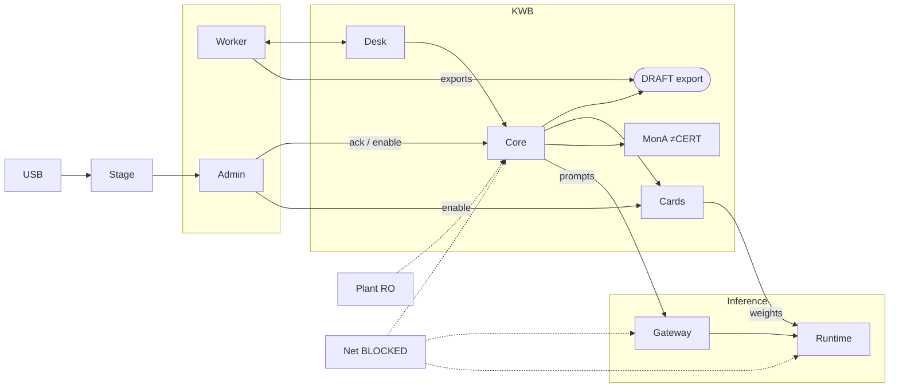
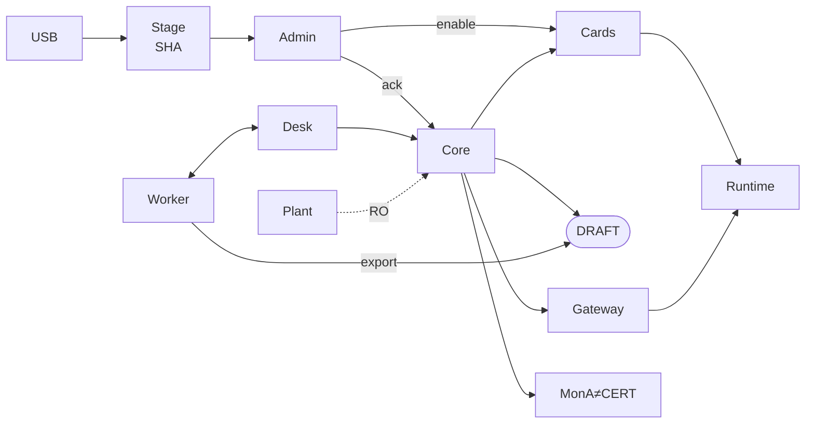

# Diagram 1 — Context diagram (bottom-of-slide band)

**Source of truth (image prompt):** [`prompt/DALLE_S02_CONTEXT.md`](./prompt/DALLE_S02_CONTEXT.md) — gen **920×420** (empty top) → crop **~920×200**  
**Topology source:** `ORG_ARCHITECTURE_DIAGRAMS.md` → **O1** (same nodes & edges)  
**Slide placement:** **Slide 2 — bottom band** (full width · ~32–38% of content height)  
**Layout rule:** Text blocks **above**; this figure **below** as a **shallow banner**. Generate tall for quality, crop to band.

---

## 0. Fit constraints (designer)

| Constraint | Target |
|---|---|
| Width | Full content panel (~90–95% slide width inside template) |
| Height | **Bottom band only** ≈ **1/3 of content** — gen at **920×420** with empty top, **crop ~920×200** into template |
| Columns | **4 lanes** left → right (see §2) |
| Font in boxes | 9–11 pt · 1–2 lines max per box |
| Caption | **One line** under the band (not a paragraph) |
| Legend | **Do not** put full actor table on the slide — keep in speaker notes |

---

## 1. Caption (one line under the band)

> Worker assisted → exports DRAFT · Admin stages USB (quarantine/SHA) → enables Model Cards → local runtime · Gateway = only inference path · Monitor A evidence pack ≠ CERT · Plant read-only · Public net blocked

---

## 2. On-slide drawing — **BOTTOM BAND** (print this)

Four lanes in one horizontal strip. Keep box heights equal.

```
┌─ PEOPLE ──────┐  ┌─ KWB (premises) ─────────────────────────────┐  ┌─ INFERENCE ────┐  ┌─ OUTSIDE ──┐
│               │  │                                               │  │                │  │            │
│  Worker       │  │  Desk ──▶ Core ──▶ DELIVERABLE                │  │  Gateway       │  │ Plant      │
│  assists desk │  │   │        │  │         ▲                     │  │  inference     │  │ read-only  │
│  exports DRAFT│◀─┼───┘        │  │         │ export              │  │  only          │  │ ◀‥ Core    │
│               │  │            │  │         │                     │  │       │        │  │            │
│  Admin (IT)   │  │            ▼  ▼         │                     │  │       ▼        │  │ Public net │
│  ack · enable │──┼──▶ Cards   MonA≠CERT    │                     │  │  Runtime /v1   │  │ BLOCKED    │
│               │  │     │                   │                     │  │  (weights)     │  │            │
└───────▲───────┘  └─────┼───────────────────┴─────────────────────┘  └───────▲────────┘  └────────────┘
        │                │                                                    │
        │                └──────── load allowed weights ──────────────────────┘
        │
   USB packs ──▶ Stage (quarantine·SHA·ack) ──▶ Admin
```

**Same topology as O1, compressed:** USB→Stage→Admin→Core/Cards→Runtime; Core→Gateway→Runtime; Worker⇄Desk; Worker→export Deliv; Core··Plant; blocked→WAN; MonA≠CERT.

---

## 3. Even tighter strip (if height is very tight)

Use **two rows only**:

```
ROW 1 (people + path):
  USB → Stage → Admin ─┬─▶ Core/Cards ─enable─▶ Runtime
  Worker ⇄ Desk → Core ┴─▶ Gateway ──────────▶ Runtime
                         └─▶ DELIVERABLE ← export ← Worker
                         └─▶ Monitor A ≠ CERT

ROW 2 (edges, tiny text under row 1):
  Plant ◀ read-only · Public internet BLOCKED (no cloud fallback)
```

---

## 4. Mermaid — **bottom-band friendly** (LR · short labels)



---

## 5. Mermaid — **single-row compact** (preferred for SVG → slide bottom)

Use this when exporting a PNG for the bottom of slide 2:



**Export tip:** Generate with DALL·E at **920×420** with empty top (`prompt/DALLE_S02_CONTEXT.md`), crop lower band (~**920×200**), place flush to **bottom** of content area; leave 4–6 pt margin above caption.

---

## 6. Color / box sizing (bottom band)

| Item | Spec |
|---|---|
| Box fill | White / light navy tint `#E8EEF5` |
| Border | `#1F497D` 1–1.5 pt |
| Accent arrows | `#0070C0` |
| Warn (blocked net) | `#C0504D` dashed |
| Box size | ~70×36 pt (Worker/Admin) · ~78×36 (Core/Gateway/Runtime) |
| Gap between lanes | 8–12 pt |
| Lane headers | Optional tiny grey labels: PEOPLE · KWB · INFERENCE · BOUNDARY |

---

## 7. Slide 2 page layout (recommended)

```
┌────────────────────────────────────────────┐
│  Official chrome / title                   │
├────────────────────────────────────────────┤
│  TOP ~62%: Proposed · How · Addresses ·    │
│            Uniqueness (points / small table)│
├────────────────────────────────────────────┤
│  BOTTOM ~35%: Context band (this diagram)  │
│  + one-line caption                        │
└────────────────────────────────────────────┘
```

Do **not** put the diagram on the right side only — bottom full-width fits O1 density better.

---

## 8. Speaker line (10 s) while pointing at bottom band

“Bottom of the slide: engineer on the left, Admin brings USB through stage and enables cards, Core talks to models only through Gateway, DRAFT export on the right, plant read-only, public net blocked, Monitor A is evidence not CERT.”

---

## 9. Binding

| Doc | Section |
|---|---|
| `ORG_ARCHITECTURE_DIAGRAMS.md` | **O1** (nodes/edges unchanged — only **layout** compacted for slide bottom) |
| Freezes | WP-01 · WP-09 · WP-10 · WP-17 · WP-19 |
