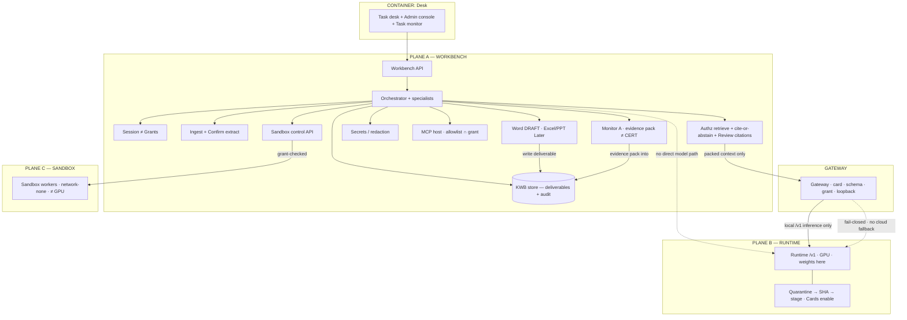
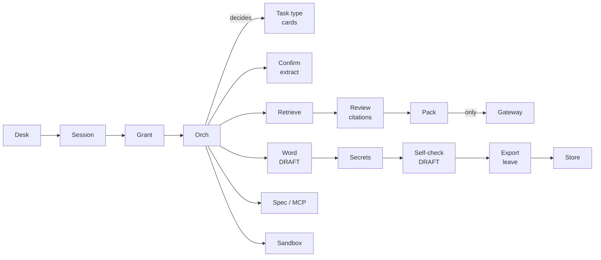

# Diagram 2 — Component / planes diagram (architecture O2 + O3 flow)

**Source of truth:**  
- `ORG_ARCHITECTURE_DIAGRAMS.md` → **O2 Planes + containers** (what runs where)  
- `ORG_ARCHITECTURE_DIAGRAMS.md` → **O3 Workbench components** (assist → export flow)  

**Slide placement:** **Slide 3 — Technical Approach**  
**Layout:** O2 planes = **top / main** (§2–§3) · **O3 assist→export = bottom/second strip** (§4 — **use this on slide**) · Layer·Tech·Purpose table below or in notes.  
**Hard rules (unchanged from org SoT):**  
Workbench ≠ Runtime ≠ Sandbox · **only Gateway → models** · sandbox ≠ GPU · Word must · Monitor A ≠ CERT · export leave ends path · no in-app forward-accept.

**Plain labels on the slide** (no bare H1/H2/H3 codes): Confirm extract · Review citations · Self-check DRAFT · Export leave · Accept sandbox result.

---

## 1. One-sentence caption

> Desk talks to **Workbench** services (grants · retrieve · orch · Word · audit); packed prompts leave only through the **Gateway** to the **Runtime**; **Sandbox** verifies calc/code off the GPU path; **Model Cards** + offline stage gate which weights load; **Monitor A** is an evidence pack (**≠ CERT**).

---

## 2. On-slide drawing — full architecture flow (preferred figure)

Use this for the PPT (compress fonts; keep **all** swimlanes).

```
┌─ DESK ──────────────────────────────────────────────────────────────────┐
│  Task desk (Electron)  ·  Task monitor (on demand)  ·  Admin console    │
└───────────────────────────────┬─────────────────────────────────────────┘
                                ▼
┌─ PLANE A — WORKBENCH ───────────────────────────────────────────────────┐
│                                                                         │
│  Session ≠ Grant → Task type / Model Card router → Orchestrator         │
│       │                                                                 │
│       ├─▶ Ingest / uploads / templates → Confirm extract                │
│       ├─▶ Authz retrieve → Cite-or-abstain → Review citations           │
│       │         └─▶ Context packer ──── ONLY model path ──┐             │
│       ├─▶ Specialists · skills · MCP (allowlist ∩ grant)  │             │
│       ├─▶ Word DRAFT → Secrets check → Self-check DRAFT   │             │
│       │         └─▶ Export leave → Store (deliverable)    │             │
│       ├─▶ Sandbox control API ─────────────────────┐      │             │
│       ├─▶ Audit (fail-closed) · Lineage            │      │             │
│       └─▶ Monitor A (egress evidence pack ≠ CERT)  │      │             │
│                                                    │      │             │
└────────────────────────────────────────────────────┼──────┼─────────────┘
                                                     │      │
┌─ GATEWAY ──────────────────────────────────────────┼──────┼─────────────┐
│  Card · schema · grant · loopback only             │      ▼             │
│  packed prompts ONLY  ◀────────────────────────────┘   (no orch side-door)
│         │                                                               │
│         ▼  local /v1 only · fail-closed if down · no cloud fallback     │
└─────────┼───────────────────────────────────────────────────────────────┘
          ▼
┌─ PLANE B — RUNTIME ─────────────────────────────────────────────────────┐
│  Offline stage (quarantine · SHA · ack) → Model Cards enable            │
│  → Local runtime /v1 (weights here · GPU) · sequential load             │
└─────────────────────────────────────────────────────────────────────────┘

┌─ PLANE C — SANDBOX ─────────────────────────────────────────────────────┐
│  Calc / code workers · network-none · ≠ GPU  · Accept sandbox result    │
│  (failed / red may block Export leave)                                  │
└─────────────────────────────────────────────────────────────────────────┘

  Plant systems (DCS·EAM·DMS) ◀‥ read-only connectors ‥ Workbench
  Public internet: default-deny / blocked from Workbench · Gateway · Runtime
```

---

## 3. Mermaid — **exact O2 topology** (docs / SVG — planes + containers)



---

## 4. O3 assist→export — **USE THIS ON SLIDE** (bottom / second strip)

Same **O3 topology** as `ORG_ARCHITECTURE_DIAGRAMS.md` Diagram O3 — **layout only** compacted for slide (wide · shallow · not tall spaghetti).  
Plain labels only (no bare H1/H2/H3).

### Fit constraints (designer)

| Constraint | Target |
|---|---|
| Width | Full content panel (~90–95% slide width) |
| Height | **Bottom / second strip** ≈ **25–35%** of content height |
| Rows | **2 max** |
| Box labels | 1–2 lines · 9–11 pt |
| PNG export | ~**960×160–220** (wide) |
| Caption | **One line** under the strip |

### Caption (one line)

> Desk → Session → Grant → Orch → Cards · Confirm extract · Review citations → Pack → **Gateway only** · Word → Secrets → Self-check DRAFT → Export leave → Store · Spec/MCP · Sandbox

### (a) Compact ASCII strip (designer paste)

```
ROW 1 — CORE → KNOW → GATE:
  Desk → Session → Grant → Orch → Task type/cards
       ├─▶ Confirm extract
       └─▶ Retrieve → Review citations → Pack ──only──▶ Gateway

ROW 2 — DELIVER + TOOLS:
  Orch → Word DRAFT → Secrets → Self-check DRAFT → Export leave → Store
  Orch → Specialists / MCP
  Orch → Sandbox
```

**Same O3 nodes, compressed:** Desk→Session→Grant→Orch→Cards (Orch decides); Ingest/Confirm extract; Retrieve→Review citations→Pack→Gateway only; Word→Secrets→Self-check→Export leave→Store; Specialists/MCP; Sandbox.

### (b) Compact Mermaid LR (PNG ~960×160–220)



**Export tip:** Render wide (e.g. 960×180 or 1100×200). Place as **second strip** under O2 planes, or alone if height is tight. Leave 4–6 pt above caption.

### Topology checklist (must remain)

| Path | Nodes |
|---|---|
| Core | Desk → Session → Grant → Orchestrator → Task type/cards (Orch decides) |
| Ingest | Confirm extract |
| Know | Retrieve → Review citations → Pack → **Gateway only** |
| Deliver | Word DRAFT → Secrets → Self-check DRAFT → Export leave → Store |
| Tools | Specialists / MCP · Sandbox |

---

## 5. Planes compact band (O2 height backup — not the O3 strip)

If the **planes** figure (§2) itself must shrink — not a substitute for §4 O3:

```
ROW 1 — PLANES:
  Desk → Workbench(API·Grant·Orch·Ingest·Retrieve·Packer·Word·Audit·MonA)
       → Gateway → Runtime(Cards·weights·GPU)
       ↘ Sandbox(calc/code ≠ GPU)

ROW 2 — pointer to §4:
  (O3 flow strip lives in §4 — Confirm extract → … → Export leave)
```

---

## 6. Numbered control loop (speaker / Q&A)

```
1 Intent + files (desk)
2 Open task grant (session ≠ grant)
3 Confirm extract (human)
4 Authz retrieve → cite or abstain → Review citations (human)
5 Context pack → Gateway only → Runtime /v1
6 Optional sandbox → Accept sandbox result (human)
7 Word DRAFT → Secrets → Self-check DRAFT (human)
8 Export leave → Store · Audit · Monitor A evidence pack ≠ CERT
```

---

## 7. Legend (compact — for notes, not mandatory on slide)

| Block | Role |
|---|---|
| Desk | Electron task desk · Task monitor · Admin console |
| Session ≠ Grant | Login session is not plant ACL; grant shelves tools |
| Orchestrator | Next step · specialists · cards — not plant safety decisions |
| Confirm extract | Human verifies extract before truth |
| Authz retrieve | Grant-first shelves · cite-or-abstain |
| Review citations | Human reviews cites/gaps before draft |
| Context packer | Only path that may bind to models |
| Gateway | Card/schema/grant · **only** inference socket |
| Runtime | Weights after Cards enable · local /v1 |
| Sandbox | Calc/code verify · ≠ GPU |
| Word → Self-check → Export leave | Assist → soft-copy end · no forward-accept |
| Monitor A | Egress evidence pack · **≠ CERT** |
| Store / Audit | Deliverables + fail-closed trail |

---

## 8. Designer notes

| Do | Don't |
|---|---|
| Keep **three planes + Gateway** as separate bands | Put sandbox inside Runtime |
| Label **Pack → Gateway only** | Orch arrow straight to Runtime |
| Show **Cards / stage** on Runtime side | USB/weights dumped into Desk |
| Plain checkpoint names | Bare H1/H2/H3/H7/H9 on the PDF |
| Same palette as D01 | Different style per slide |

**Suggested slide 3 layout:**  
Top ~45–55% = O2 planes (§2/§3) · Mid/bottom ~25–35% = **O3 strip (§4 — use on slide)** · Rest = Layer/Tech/Purpose (≤6 rows) or notes.

---

## 9. Demo mapping (honesty)

| Architecture box | Demo today |
|---|---|
| Task desk | `apps/kwb-app` Electron |
| Workbench API | FastAPI `:8080` |
| Cards | `inspect-draft` · `code-assist` |
| Runtime | Ollama `/v1` (org: vLLM / llama.cpp) |
| Sandbox | `/sandbox/calc` · `/sandbox/python` |
| Monitor A | `/monitor-a/start|stop` |
| Word + export leave | `/task/inspect-draft` · `/task/export` |
| Excel/PPT · live connectors · full MCP | Later |

---

## 10. Speaker line (20 s)

“Inside: the desk drives the workbench plane — grants, confirm extract, retrieve, packer, Word, audit. Packed prompts leave **only** through the gateway to the runtime where Admin-enabled cards load weights. Sandbox is a third plane for calc and code. Flow ends at export leave into the store — Monitor A is evidence, not CERT.”

---

## 11. Binding

| Doc | Section |
|---|---|
| `ORG_ARCHITECTURE_DIAGRAMS.md` | **O2** · **O3** |
| `ARCHITECTURE_HIGH_LEVEL.md` | §3 planes · §4 components · §5 loop |
| Freezes | WP-06 orch · WP-09 gateway · WP-10 runtime · WP-16 sandbox · WP-17 MonA |
