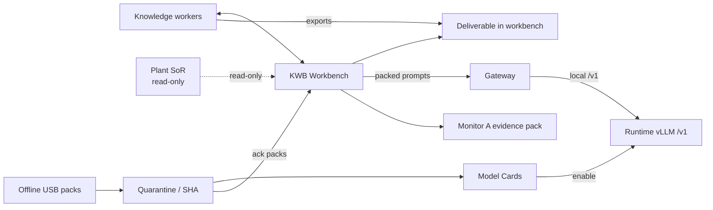
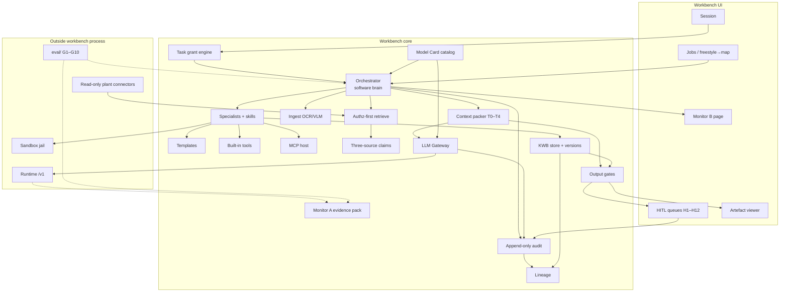
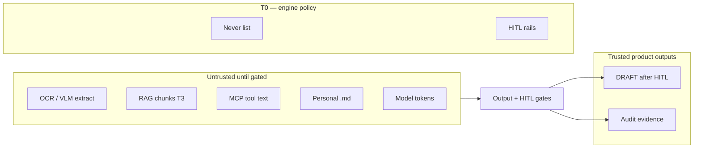

# KWB — High-level architecture

**Date:** 2026-09-19  
**Status:** **ALIGNED** to `../freezes/WP-20_FREEZE.md` rev 1.0  
**Binding picture:** WP-20 freeze · figures in `../prototype/ORG_ARCHITECTURE_DIAGRAMS.md`  
**Stack brands:** **not** in this file — see `TECH_STACK_SOURCE_OF_TRUTH.md`.  
**Freezes:** `../freezes/WP-*_FREEZE.md`  
**Official PS:** `../../sih_research/sovereign-ai-workbench-kb/01-problem-context/01-problem-statement.md`

---

## 1. One sentence

Offline **workbench software** (no weight files) talks only through a **gateway** to a **runtime** that serves open-weight models; it **assists** until the worker **exports** a deliverable; **no in-app accept-for-forward**; plant systems are **read-only**; sovereignty shown via **Monitor A evidence pack** (not CERT).

---

## 2. Context (who / what)



| Actor / system | Role | SoT |
|---|---|---|
| Knowledge worker | Assisted in desk; **exports** deliverable when task complete | WP-01, flow F6 · **D1** |
| Admin | Quarantine ack / allowlist / **card enable** | WP-01, WP-19 |
| Plant SoR | Read-only sources; **never** written by KWB | WP-00, WP-02 |
| Gateway | Inference choke only — does **not** build Word | WP-09 |
| vLLM | Weights on runtime; card-gated load; no cloud fallback | WP-10 |
| USB → stage | Quarantine/SHA before trust | WP-19 |
| Monitor A | Hash-chained **egress evidence pack** — posture, **not CERT** | WP-17 · **D2** |
| Deliverable | Word DRAFT ± evidence — **export ends solution** | WP-00, DM **D1** |

---

## 3. Three planes (hard separation)

```text
┌──────────────────────────────────────────────────────────────────┐
│  A. WORKBENCH  (product behaviour — no model weight files)         │
│  UI · session · grants · orch · specialists · packer · gateway     │
│  HITL · RAG · MCP host · cards catalog · gates · audit · monitors  │
└─────────────────────────────┬────────────────────────────────────┘
                              │  ONLY gateway opens socket
                              │  local OpenAI-shape /v1
┌─────────────────────────────▼────────────────────────────────────┐
│  B. RUNTIME  (hardware plane)                                      │
│  staged open-weight (± quant) · /v1 server · load/LRU · GPU probe  │
└──────────────────────────────────────────────────────────────────┘
┌──────────────────────────────────────────────────────────────────┐
│  C. SANDBOX  (code / calc verify)                                  │
│  best-effort default + isolation menu · ≠ GPU inference            │
└──────────────────────────────────────────────────────────────────┘
```

| Plane | Owns | Never owns | SoT |
|---|---|---|---|
| Workbench | Policy, grants, HITL, drafts, Monitor A | Weight files, plant writes | WP-00, WP-20 |
| Runtime | Serve `model_id` after card enable | Task routing, plant ACL | WP-10, WP-24 |
| Sandbox | Verify code/calc (best-effort + menu) | Inference, Docker-as-identity | WP-16 |

---

## 4. Logical component architecture



**Hard rules**

1. **Only the gateway** opens the runtime socket (WP-09 / WP-20 F3).  
2. **Unmasked on-screen view** only after G-secret / G-class (WP-12 / WP-20 F2).  
3. Orchestrator decides **workbench next steps** under grants/HITL/Never — **not** plant safety outcomes (WP-06 / WP-20 F7).  
4. Artefacts **never** write plant SoR (WP-00 / WP-02).

---

## 5. Control loop (happy path)

```text
Login (session ≠ plant access)
  → Task GRANT (sources, tools, ceiling, TTL)
  → Orchestrator → specialist + skills + Model Card
  → [scan] Ingest → H1 → only then KB promote path
  → Authz-first RAG (k≤5) → Claims / H7
  → Packer (T0–T4) → Gateway verify → Runtime
  → Tools / sandbox / MCP under grant ∩ allowlist
  → Output gates → Templates → DRAFT in KWB store
  → HITL H2 / H9 / H3 (human ultimate verifier)
  → Audit (fail-closed) + Lineage + Monitors A/B
```

Detail: `WP-20_ORG_CONNECTION.md` §4.

---

## 6. Trust & trust boundaries



| Boundary | Rule | SoT |
|---|---|---|
| T0–T4 content classes | Packer labels; untrusted ≠ policy engine | WP-23, WP-21 |
| Grant vs session | Login ≠ plant ACL; revoke copies | WP-04 |
| Audience A vs B | Host evidence pack ≠ app “SECURE” / CERT | WP-13 |
| eval/ vs jury audit | Keep eval pack even if jury-day wipe | WP-18, WP-20 F8 |

---

## 7. Demo slice vs org (same architecture)

| Concern | Demo slice | Org ambition |
|---|---|---|
| Jobs | Inspect→Word + code (+ multimodal) | Full catalog |
| Models | ≤3 cards; pre-load 2; GPU+CPU OK | GPU-only; more cards |
| MCP | One MOCK allowlisted server | Full local lifecycle |
| Connectors | MOCK SOP/policy packs | Live read-only connectors |
| Monitors | Snapshot A + page B | Continuous A |
| Build bar | **G1–G10 spine first** | Same + more goldens |

PPT / Excel / live mail = **Description overhang** → not claimed unless REAL in overlay (`WP-20` §8).

---

## 8. Expected Solution caption

| Expected Solution | Architecture box |
|---|---|
| Local workstation/server, mid-range GPU, smaller model OK | Runtime plane |
| Auto-select ≥2 task types | Orch + Model Cards + G1 |
| Scan → findings → Word approval note | Ingest → H1 → templates → H2/H3 |
| Coding + sandbox verify | Specialist + sandbox ≠ GPU |
| Multimodal | Ingest OCR/VLM cards |
| Logs / network monitor; no external calls | Audit + Monitor A/B; gateway deny WAN |
| Air-gap / nothing leaves | Never + offline USB |

---

## 9. What this diagram is **not**

- Not a physical rack / VLAN drawing.  
- Not a brand lock (Ollama vs vLLM vs …).  
- Not the prototype REAL/MOCK/LATER overlay (next after WP-20 freeze).

---

## 10. Related files

| File | Role |
|---|---|
| `WP-20_ORG_CONNECTION.md` | Connected solution + verify checklist |
| `WP-20_REDTEAM.md` | Full-system adversarial critique |
| `TECH_STACK_SOURCE_OF_TRUTH.md` | Interfaces locked vs brands open |
| `DESIGN_REPO_MAP_v1.md` | Adopt / refuse patterns (pre-freeze input) |
