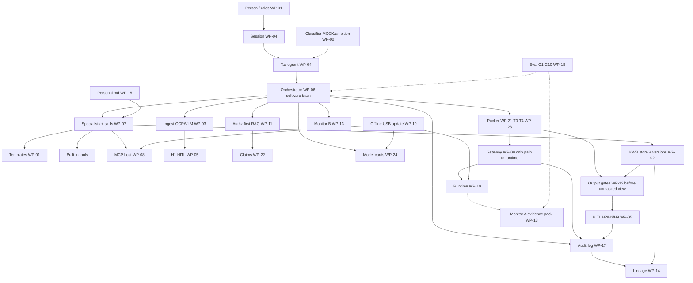

# WP-20 — KWB org connection design (HISTORICAL DRAFT)

**Date:** 2026-09-18 (draft) · **Superseded:** 2026-09-19  
**Status:** **SUPERSEDED** — binding freeze is `../freezes/WP-20_FREEZE.md` rev 1.0 (GATE_90 A2).  
**Red-team:** `WP-20_REDTEAM.md` (historical).  
**Keep for:** history of F1–F8 fills. Do **not** treat this file as binding.

**Binding inputs:** All `../freezes/WP-*_FREEZE.md`. Official PS: `../../sih_research/sovereign-ai-workbench-kb/01-problem-context/01-problem-statement.md`.

---

## 1. Product in one sentence

**KWB** is a **fully offline software workbench** that helps industrial knowledge workers draft real artefacts (Word, code, multimodal understanding) using **pluggable open-weight models** on a **separate runtime**, under **task grants + HITL**, grounded in **local knowledge** with honest citations — humans remain the **ultimate verifier**; the **orchestrator** is the **software brain** of the app loop (**not** the plant decision-maker). Security controls **help**; they are **not** plant certification / CERT-In badges.

---

## 2. Two planes (always)

```text
┌─────────────────────────────────────────────────────────────┐
│  WORKBENCH SOFTWARE (no weight files)                         │
│  UI · session · grants · orchestrator · specialists · tools │
│  packer · gateway client · HITL · RAG · MCP host · skills   │
│  cards catalog · gates · audit · lineage · monitors           │
└───────────────────────────┬─────────────────────────────────┘
                            │ local /v1 only (verified)
┌───────────────────────────▼─────────────────────────────────┐
│  RUNTIME HARDWARE                                             │
│  staged open-weight (quant OK) · /v1 server · load/LRU · GPU  │
└─────────────────────────────────────────────────────────────┘
         sandbox ≠ GPU process
```

| Plane | Owns | WP |
|---|---|---|
| Workbench | Product behaviour | 00–09, 11–19, 21–24 |
| Runtime | Weights + serve | **10** (+ 19 stage) |
| Sandbox | Code verify | **16** |

---

## 3. Master connection diagram



**Hard rules on this picture:** (F3) **Only the gateway** opens the runtime socket. (F7) Orchestrator decides workbench next steps under grants/HITL/Never — **not** plant safety outcomes.

---

## 4. End-to-end control loop (happy path)

```text
1. Login (session) ≠ plant access
2. Start job → task GRANT (sources, tools, ceiling, TTL)
   (classifier MOCK/ambition may label; does not replace grant)
3. Orchestrator maps job → specialist + skills + Model Card
   (demo freestyle → constrained map; org job_id required)
4. If scan: INGEST → H1 verify extract → only then KB path
5. RETRIEVE authz-first under grant → chunks T3 → CLAIMS / H7
6. PACKER builds messages (token-vs-window, delimiters) + PackManifest
7. GATEWAY verifies auth, schema, grant, card, local endpoint, size…
   — ONLY gateway may open runtime socket —
8. RUNTIME serves model_id (warm 2 / LRU; org GPU-only)
9. Tools / sandbox / MCP under grant ∩ allowlist
10. OUTPUT GATES (secret/class/cite/file/sandbox/fresh/pack)
    — unmasked on-screen view only after G-secret/G-class pass —
11. Templates → DRAFT in KWB store; HITL H2 / H9 / H3 — human ultimate verifier
12. Artefacts only in KWB store (never write plant SoR)
13. AUDIT append-only (fail-closed on write fail) + LINEAGE diagram
    (lineage_degraded soft ≠ audit soft)
14. MONITORS A/B; eval/ pack retained for jury even if audit is jury-day
```

**On failure:** fail-closed (or degrade only where a freeze allows) — **WP-18** goldens prove it.  
**SIH build order:** implement **G1–G10 spine** first; everything else MOCK/LATER until demo_ready.

---

## 5. WP → box map (nothing orphaned)

| WP | Box in the picture |
|---|---|
| **00** | Product contract, planes, Never, assist≠decide |
| **01** | Roles, jobs, artefacts (inspect/code must) |
| **02** | Read-only connectors; KWB output store + versions |
| **03** | Pre-LLM ingest OCR/VLM |
| **04** | Session ≠ grant; revoke; ceiling |
| **05** | HITL H1–H12; stale re-approval |
| **06** | Orchestrator = software brain; route; failover |
| **07** | Specialists, skills, tools matrix |
| **08** | Local MCP host; H5; egress deny |
| **09** | Gateway verify suite → local `/v1` |
| **10** | Runtime load/serve; probe; quant; single-key multiplex |
| **11** | Authz-first RAG; k=5; citations |
| **12** | Output gates before view/export |
| **13** | Monitors A (evidence pack / snapshot — not CERT) + B (operator page) |
| **14** | Task lineage manifest + node diagram |
| **15** | Personal `.md` harness (not PS-mandated) |
| **16** | Sandbox network-none; ≠ GPU |
| **17** | Audit evidence log |
| **18** | Fail-closed + golden G1–G10 / eval/ |
| **19** | USB offline import; Admin enable |
| **21** | Context packer / data-to-pass |
| **22** | Three-source claims + H7 |
| **23** | Untrusted content T0–T4 |
| **24** | Model Card catalog; model-agnostic UI |

---

## 6. Pluggable entities (same pattern)

| Plug | Swap without redesign | Locked policy (not a plug) |
|---|---|---|
| Model cards + runtime URL | WP-24/10/19 | Air-gap, HITL, Never-write-SoR |
| MCP packs | WP-08/19 | Grant ∩ allowlist; T3 |
| KB connectors | WP-02/11 | Authz-first; read-only |
| Skills (org/personal) | WP-07/15 | Progressive load; H6 |

---

## 7. Demo slice vs org (same architecture)

| Concern | Demo | Org |
|---|---|---|
| Jobs | inspect-to-note + code (+ multimodal) | Full catalog |
| Models | ≤3 cards; pre-load 2; quant; GPU+CPU OK | GPU-only; more cards |
| MCP | One MOCK pre-allowlisted | Full local lifecycle |
| Gateway | Same code; show subset of denies | Full verify every call |
| Monitors | Snapshot A + Monitors page B | Continuous A ambition |
| Eval | G1–G10 + eval/ pack | Same + more goldens |
| Intake | USB import UI; size+eyeball | SHA/quarantine ambition |

---

## 8. Official Expected Solution — caption test

| Expected Solution clause | Satisfied by |
|---|---|
| Local deploy workstation or server, mid-range GPU, smaller model OK | WP-00/10 |
| Auto-select ≥2 task types | WP-06/24/18 G1 |
| Scan → findings → Word approval note | WP-03/01/05/18 G2 |
| Coding + sandbox verify | WP-16/07/18 G3 |
| Multimodal image/scan | WP-03/24/18 G4 |
| Logs or visible network monitor; no external calls | WP-17/13/18 G5 |
| Air-gap / nothing leaves | WP-00/09/19 Never |

**Caption:** The diagram matches the **Expected Solution**. Demo is a **slice**, not a different product.

### Description overhang (honesty — not must-work for SIH)

| Official Description item | Org design | SIH demo |
|---|---|---|
| Spreadsheet work | Ambition | **LATER / not claimed** |
| PPT / Excel files | Deferred (WP-00) | **LATER / not claimed** |
| Full engineering calc product | Thin; calc-in-sandbox must | Show jail calc only |
| Live correspondence corpus | Ambition | MOCK SOP/policy OK |
| “Models at once” | Catalog multi; VRAM may LRU | Honest sequential OK |

Do **not** put PPT/Excel/live DMS in jury claims unless REAL in overlay.

---

## 9. Never (cross-cutting — do not drop in prototype)

- Cloud LLM / public `base_url` / HF-in-UI  
- Write DCS/EAM/ERP/DMS SoR  
- Safety/FFS/statutory autonomy (human verifier)  
- Fail-open to internet or unregistered model  
- App-only “SECURE” without host evidence (Audience A)  
- Auto-promote personal → org; weight-train on plant data  

---

## 10. What we do **after** you verify

1. **Freeze WP-20** (this document → `WP-20_FREEZE.md`).  
2. **Prototype overlay:** mark each box **REAL / MOCK / LATER**.  
3. Bind build order to **WP-18 G1–G10**.  
4. Only then: stack choices + app code when you ask.

---

## 11. Verify checklist (you)

Confirm or correct:

1. Master loop §4 matches software brain + human verifier (+ F2/F3 gate/gateway rules).  
2. No frozen WP missing from §5; templates/classifier noted.  
3. Demo vs org §7 + Description overhang honesty OK.  
4. Expected Solution caption §8 OK.  
5. Accept full-system red-team `WP-20_REDTEAM.md` (confidence ~0.84 design).  
6. Ready to freeze WP-20 and start REAL/MOCK/LATER overlay (G1–G10 spine first).

Reply **verify OK** (or list fixes).
