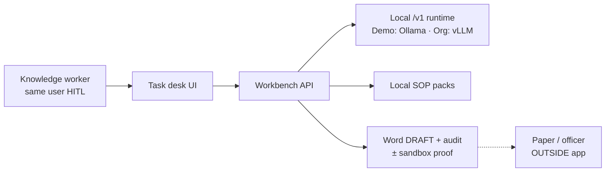
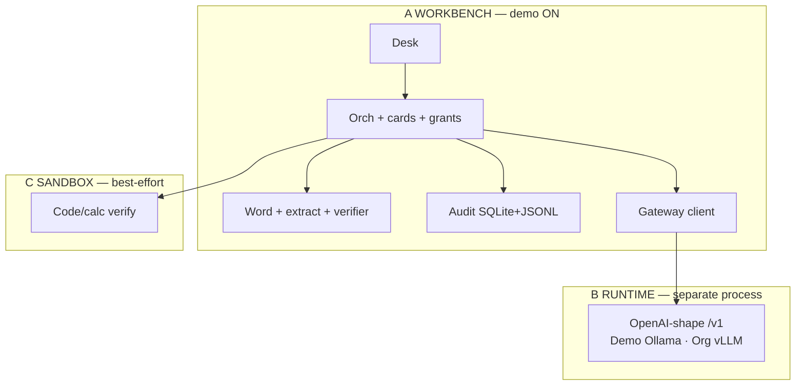
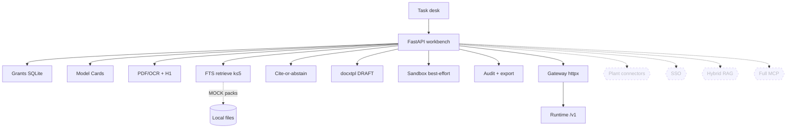

# Architecture diagram — discussion draft (demo + org ghost)

**Date:** 2026-09-19  
**Status:** **SUPERSEDED FOR ORDER** — org diagrams first: see `ORG_ARCHITECTURE_DIAGRAMS.md`. This file remains a draft for **later demo narrow** of diagrams.  
**SoT:** `DEMO_TECH_STACK.md` · `ORG_TECH_DESIGN.md` · Flow A→J  

---

## What we need from you next

Confirm which diagrams we finalize (recommend **all three**):

1. **Context** — who talks to what (jury machine)  
2. **Planes** — Workbench / Runtime / Sandbox  
3. **Component** — demo boxes ON (solid) · org-only (dashed ghost)  

---

## Diagram A — Context (demo)

## Diagram B — Three planes (always)

## Diagram C — Components (demo solid / org dashed)

---

## Open questions for diagram clarity

1. Show **gateway** as box inside workbench (demo) or always draw separate process?  
2. Show **Audience A** monitor as its own box?  
3. One diagram for PPT later vs three technical diagrams now?

Reply with edits + answers; we freeze diagram set next.
