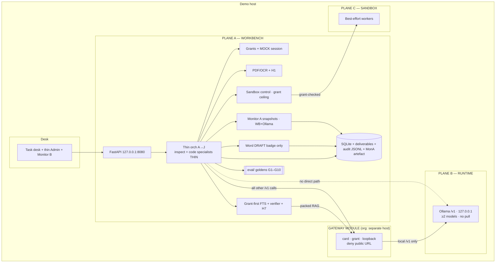
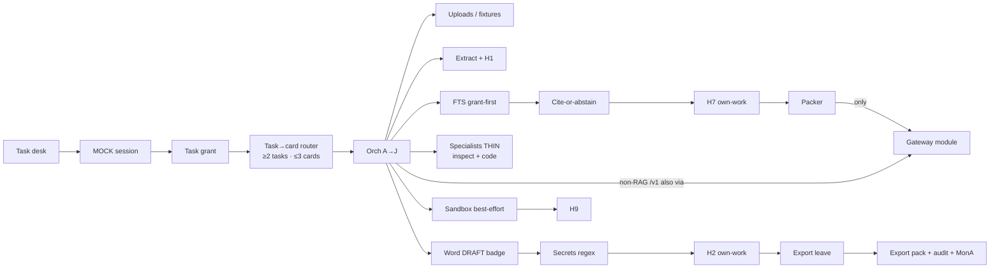
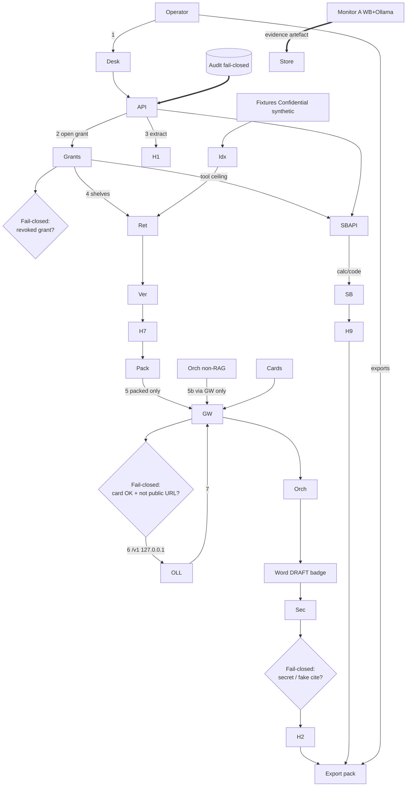
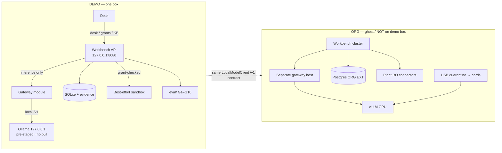
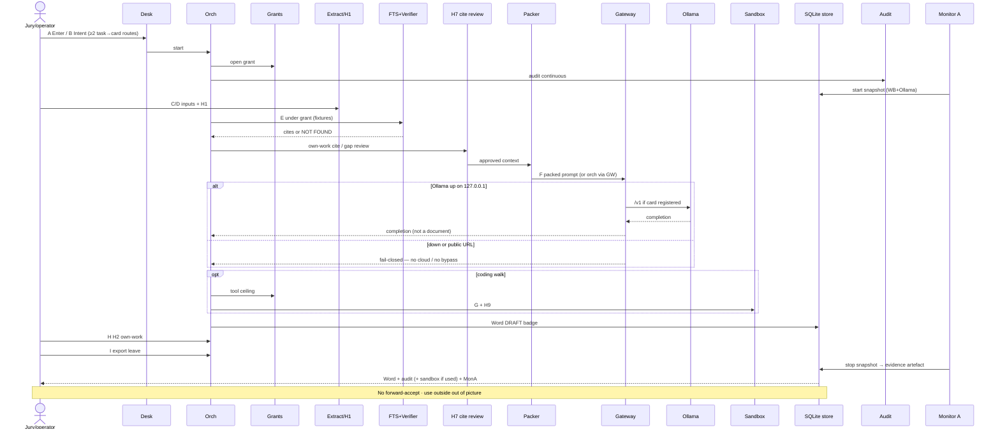

# KWB — Demo architecture diagrams (narrowed)

**Date:** 2026-09-19  
**Status:** **DEMO DIAGRAMS ACCEPTED** — 2026-09-19 (adversarial discuss locks applied)  
**Parent:** `ORG_ARCHITECTURE_DIAGRAMS.md` (**ACCEPTED**) · `DEMO_TECH_STACK.md` (accepted narrow)  
**Rule:** Same spine as org. Demo = slice on one box. Runtime demo = **Ollama**. Org runtime stays **vLLM**.  
**Product boundary:** Same as org — **assist → export**; no in-app accept-for-forward; Monitor A = evidence (not CERT).  
**Honesty:** A→J **slice** (no live plant / full MCP / continuous WAN). Gateway in-process = **(org: separate host)**.  
**Roles:** self-HITL (WP-05/01/00 rev 2.0); Approver = org paper outside.  
**G1:** floor = single-tag adopt OK (WP-18 rev 1.1 / GATE_90 A3).  
**Connection:** WP-20 **FROZEN** 1.0 · A4/A5 · design B1–B7 locked — **GO build desk**.  
**Next:** implement G1–G10 desk · PPT after execute ≥0.90  

---

## Adversarial discuss locks (open Qs → decided)

| Q | Adversarial finding | **Lock** |
|---|---|---|
| **1 Ghost on D1?** | SIH: one clear diagram; ghost next to live box confuses “what runs today” | **D1 = live box only.** Ghost only on **D5** (appendix / technical) |
| **2 In-process GW?** | Control = deny public URL + no bypass; separate process is org hardening, not SIH must | **In-process OK** for demo; always label **(org: separate host)** |
| **3 Always H7?** | Skip when no cite path wastes jury time; silent skip when cites exist is a hole | **H7 when E returns cites**; skip only if E skipped or NOT FOUND with nothing to review |
| **4 Snapshot vs airplane?** | Architecture evidence = start/stop artefact; live unplug is **stage procedure** | **Snapshot pair = G5 REAL**; airplane-mode = demo-day script (not a diagram box) |
| **5 D5 to jury?** | Demo first, architecture after they ask | **D5 = technical appendix**; not opening slide |
| **6 Three walks?** | Time kills third walk; fail-closed proves sovereignty | **Mandatory: inspection + one fail-closed.** Coding walk if time |

**Score after locks:** ~**0.85** accept — residual = implementation proofs only.

---

## Narrow map (org box → demo)

| Org (accepted O1–O6) | Demo (this file) |
|---|---|
| Multi-node workbench + separate gateway host | One workstation; gateway **module** OK if no bypass **(org: separate host)** |
| vLLM GPU farm | **Ollama** same host, separate process · **127.0.0.1** · ≥2 pre-staged · **no pull on box** |
| Plant connectors read-only | **MOCK** fixtures · **Confidential synthetic** |
| USB quarantine → signed registry | Pre-staged weights + show path once |
| Monitor A evidence pack | **Start/stop snapshot** on **WB + Ollama** → artefact in store |
| Sandbox isolation menu | **Best-effort only** (Docker optional, not required) |
| Excel/PPT · SSO · Postgres · hybrid · full MCP | **OFF / LATER** |
| Admin full console | **THIN** (cards + stage note) |

**Ghost org:** Label **NOT on demo box** so jury never thinks scale-up runs on the laptop.

---

## Product boundary (inherited — binding)

| In | Out |
|---|---|
| Assist in workbench · own-work HITL · **export** Word DRAFT ± evidence | In-app forward/accept · how to use file after export · plant filing |

---

## Discuss pack — detailed claim per diagram (for DM)

Say **OK / change: …** per diagram. Accept only when all six are OK. Then **add REAL** = implement `DEMO_TECH_STACK` REAL tags on this spine.

### Inherited locks (org — do not re-open unless you reopen)

| Lock | On demo |
|---|---|
| Assist → export | Jury finishes task → **exports** Word+evidence; no boss queue |
| No forward-accept | H1/H7/H2/H9 = own-work only |
| Monitor A ≠ CERT | Snapshot evidence artefact only |
| Sandbox best-effort | No gVisor claim on laptop |
| Same `/v1` contract | Ollama (demo) ↔ vLLM (org) behind LocalModelClient |

### D1 — System context (jury)

| Claim | Detail |
|---|---|
| One box | Desk + API + GW module + store + MonA + **Ollama** on same workstation |
| Leave-with | EXPORT = Word **DRAFT badge** ± audit / sandbox / MonA |
| Inference | WB → GW → Ollama loopback only |
| Offline | Ollama **127.0.0.1**, ≥2 pre-staged, **no pull**; WAN blocked |
| Knowledge | Fixtures **Confidential synthetic** |
| Ghost org | Drawn as **NOT on demo box** |
| **Open Q** | Keep ghost on jury D1, or only on D5? |

### D2 — Planes (implementer)

| Plane | Demo | Must not |
|---|---|---|
| UI | Desk + thin Admin + Monitor B | Hold weights |
| A Workbench | FastAPI `127.0.0.1:8080`, orch (inspect+code THIN), grants, H1, FTS+H7, Word, SQLite, SB API, MonA, eval/ | Call Ollama without GW |
| Gateway | **In-process module** (org: separate host) | Build Word |
| B Runtime | Ollama process | Task policy |
| C Sandbox | Best-effort | Inference |
| **Open Q** | In-process GW OK for SIH, or separate process even on demo? |

### D3 — Components (builder)

| Path | Steps | Tag |
|---|---|---|
| Identity | MOCK session → REAL grant → ≥2 tasks / ≤3 cards | Mixed |
| Ingest | Uploads/fixtures → extract → H1 | REAL light |
| Knowledge | Grant FTS → cite-or-abstain → H7 → Pack → GW | Data MOCK / logic REAL |
| Assist | Specialists THIN; all `/v1` via GW | REAL |
| Deliver | Word DRAFT → secrets → H2 → **export leave** | REAL |
| Code | Sandbox → H9 → export proof | REAL |
| OFF | Excel/PPT, live connectors, hybrid, MCP, SSO, Postgres | — |
| **Open Q** | Always H7, or skip when E skipped on thin walk? |

### D4 — Trust (security)

| Control | Fail-closed |
|---|---|
| Grant open/revoke | Revoked → no tools |
| H1 before trust extract | — |
| Grant before retrieve → H7 → pack | No unauthorized chunk to model |
| All `/v1` via GW; card + not public URL + 127.0.0.1 | Else deny |
| Secrets / fake cite before export | Block export |
| Sandbox after tool ceiling | — |
| Audit fail-closed; MonA WB+Ollama → store | Not CERT |
| **Open Q** | Snapshot pair enough for G5, or live airplane-mode show? |

### D5 — Demo vs ghost deploy

| Demo | Ghost (not running) |
|---|---|
| One box · SQLite · Ollama · best-effort SB · eval/ | Separate GW · vLLM · Postgres EXT · plant RO · USB stage |
| Bridge | Same **LocalModelClient `/v1`** |
| **Open Q** | Show D5 to jury, or appendix only? |

### D6 — Walks (script)

| Walk | Path | G-bar |
|---|---|---|
| Inspection | A→B→MonA start→C/D+H1→E→H7→F→Word→H2→export→MonA stop | G1,G2,G4,G5,G6… |
| Coding | …→G→H9→export (+ sandbox proof) | G3,G10 |
| Fail-closed | Revoke / bad card / public URL / secret / NOT FOUND | G7,G8,G9 |
| **Open Q** | All three on stage, or inspection + one fail-closed? |

### After accept → add REAL (preview)

Implement in order (from stack): FastAPI desk spine · grants · cards/router · gateway→Ollama · Word DRAFT · FTS+verifier · H1/H2/H9 · sandbox best-effort · audit JSONL · Monitor A snapshots · eval goldens. MOCK stays MOCK. No PPT until REAL+impl red-team.

---

## Diagram D1 — System context (demo)

**Question:** What does the jury see on one offline box?

```mermaid
flowchart LR
  Jury[Jury / demo operator]

  subgraph BOX["One workstation — offline posture"]
    Desk[Task desk<br/>assist · self-HITL]
    WB[Workbench API<br/>127.0.0.1:8080]
    GW[Gateway module<br/>no bypass · deny public URL<br/>org: separate host]
    Deliv([EXPORT<br/>Word DRAFT badge ± evidence])
    MonA[Monitor A<br/>start/stop snapshot<br/>WB+Ollama · not CERT]
    Store[(Store · audit · evidence)]
    OLL[Ollama process<br/>127.0.0.1 only<br/>≥2 pre-staged · no pull]
    Desk --> WB --> Deliv
    WB --> MonA --> Store
    WB --> Store
  end

  Fixtures[Fixtures<br/>Confidential synthetic<br/>SOP · scans · templates]
  WAN((Public internet<br/>default-deny · no cloud fallback))

  Jury <-->|assists| Desk
  Jury -->|exports| Deliv
  Fixtures -->|MOCK inputs / KB| WB
  WB -->|all model calls packed| GW
  GW -->|loopback /v1 only| OLL
  WB -.->|blocked| WAN
  GW -.->|blocked| WAN
  OLL -.->|blocked · no registry| WAN
```

| Element | Demo role |
|---|---|
| Jury / operator | Assist then export |
| Workbench | A→J **slice** on one host |
| Gateway module | In-process OK; no bypass; deny public URL |
| Ollama | **Inside** host; 127.0.0.1; pre-staged; **no pull** |
| Fixtures | MOCK · Confidential synthetic |
| Monitor A | Snapshots → evidence in **store** (arrow never to WAN) |

**Ghost org:** not on D1 (jury) — see **D5** only.

---

## Diagram D2 — Planes on one machine (demo)

**Hard rules:** weights only in B · **all** inference via GW · GW ≠ Word · sandbox ≠ Ollama · export from store · no cloud fallback · no `ollama pull` on box.

---

## Diagram D3 — Workbench components (demo ON)

**OFF on demo:** Excel/PPT · live connectors · hybrid · full MCP · SSO · Postgres.

---

## Diagram D4 — Trust path (demo critical)

**Same invariants as org O4.** Demo Monitor A = snapshot pair on **workbench + Ollama**, not continuous SRE.

---

## Diagram D5 — Deployment (demo vs ghost org)

---

## Diagram D6 — Flow A→J (demo walks)

| Demo walk | Path | G-bar |
|---|---|---|
| Inspection note | A→D→E→H7→F→H→I + J | G1,G2,G4,G5,G6… |
| Coding + calc | …→G→H9→I | G3,G10 |
| Fail-closed | revoke / bad card / public URL / secret / NOT FOUND | G7,G8,G9 |

---

## Deliberately omitted on demo diagrams

| Omitted | Why |
|---|---|
| Live plant / SSO / Postgres / Excel-PPT | DEMO_TECH_STACK OFF |
| CERT / continuous WAN SRE | Snapshot evidence only |
| In-app forward-accept | Org **D1** |
| Claiming laptop = org farm | Ghost = **NOT on demo box** |
| `ollama pull` / HF on demo day | Pre-stage only |
| Ollama on `0.0.0.0` | Bind **127.0.0.1** only |

---

## DM discuss checklist (demo)

| # | Item | Status |
|---|---|---|
| 1 | Accept D1–D6 revised | **ACCEPTED 2026-09-19** |
| 2 | In-process GW + 127.0.0.1 Ollama | **Locked** |
| 3 | Monitor A snapshot WB+Ollama | **Locked** |
| 4 | Discuss Qs 1–6 | **Locked** (adversarial table above) |
| 5 | Add REAL | **IN PROGRESS** |
| 6 | Red-team implementation | After REAL spine |

---

## Adversarial research + red attack on D1–D6 — resolution log

**Prior:** ~0.58. **After fixes below:** ~**0.80** accept-ready.

### External research (applied)

Ollama offline only after pre-stage; bind **127.0.0.1** (no auth → never `0.0.0.0`); gateway is the real control; no pull/registry on demo box; Monitor A must cover **Ollama** not only workbench.

### Mistakes — fixed

| ID | Fix |
|---|---|
| **DM1** | Ollama **inside** workstation box |
| **DM2** | MonA → store evidence; no MonA→WAN |
| **DM3** | D5: UI→WB desk; WB→GW→Ollama inference only |
| **DM4** | D4: grant ceiling before sandbox |
| **DM5** | D2/D3: all `/v1` via GW (RAG pack + non-RAG) |
| **DM6** | D6: H7 first-class participant |
| **DM7** | Export leave (not H3 forward); stack note: treat H3 as export gate |

### Missing — fixed

| ID | Fix |
|---|---|
| **DG1–DG3** | 127.0.0.1 · no pull · deny public URL diamonds |
| **DG4–DG5** | ≥2 tasks/cards · DRAFT badge |
| **DG6–DG11** | eval/ · Confidential synthetic · FastAPI bind · specialists THIN · LocalModelClient · MonA scope WB+Ollama · sandbox grant |
| **DG12** | WP-05 header note |

### Overhyped — stripped

Full spine → **slice** · offline needs bind+no-pull+MonA · in-process GW labeled **(org: separate host)** · ghost **NOT on demo box**.

### Residual (implementation red-team — not diagram)

Prove no-bypass in code · Ollama version pin · Windows outbound firewall jury-day · WP-05 freeze edit.
