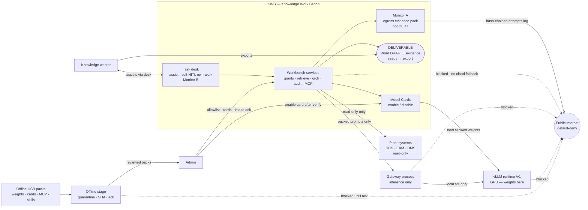
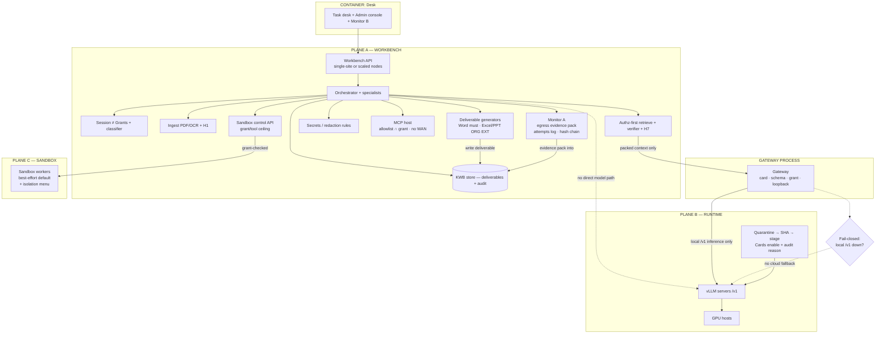
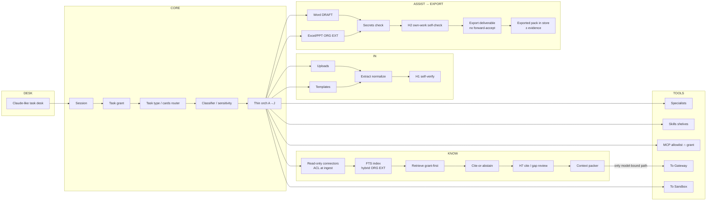
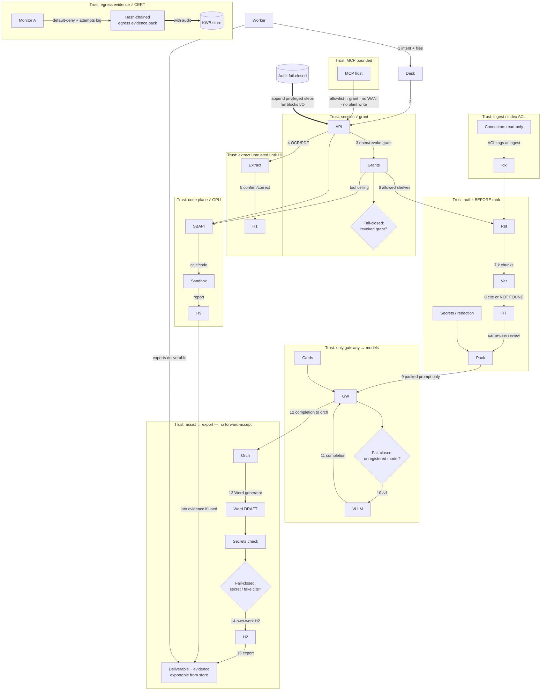
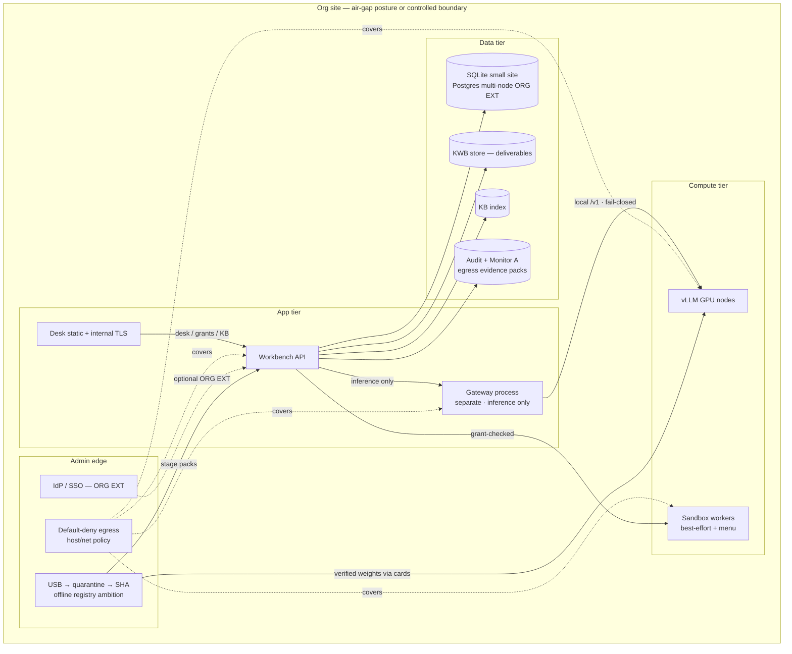
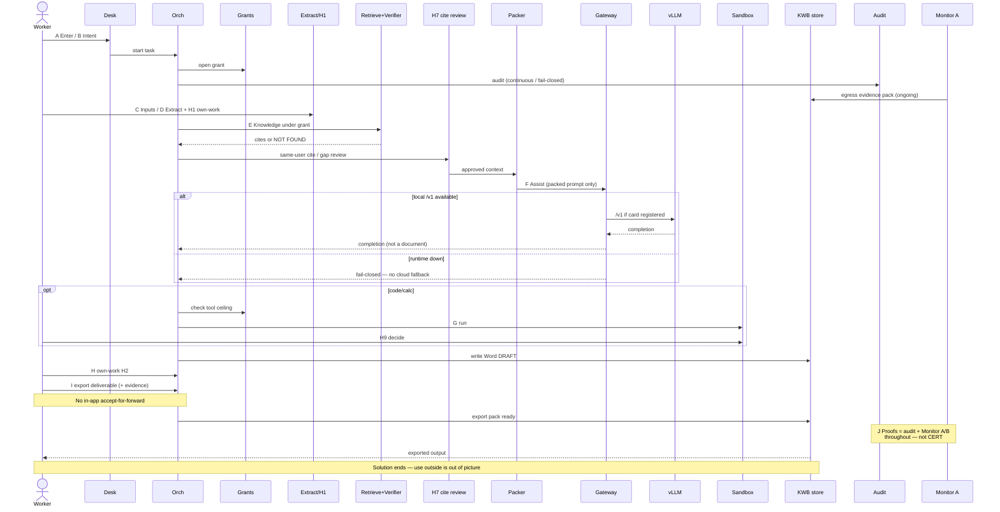

# KWB — Organisation architecture diagrams

**Date:** 2026-09-19  
**Status:** **ORG DIAGRAMS ACCEPTED** — DM figure pass 2026-09-19 (O1 OK · O4 no change · O6 yes · O2/O3/O5 perfect)  
**Next process gate:** **Demo-narrow diagrams** (`DEMO_ARCHITECTURE_DIAGRAMS.md`) · then add REAL · red-team  
**Rule:** Organisation diagrams **accepted**. Demo narrow = this next gate.  
**SoT:** `ORG_TECH_DESIGN.md` (accepted) · Flow A→J · freezes · runtime org **vLLM**  
**Method:** C4-style levels + trust-boundary data flow  
**Honesty:** Air-gap = strongest **posture** with **Monitor A evidence pack** (not CERT / not accreditation). Controlled-boundary sites = same spine + same evidence duty.  
**Freeze note:** Diagrams use **self-HITL** (own-work). **No in-app accept-for-forward.** WP-05 **FROZEN rev 2.0** (2026-09-19). Next: reopen WP-01.  

---

## Product boundary (DM 2026-09-19 · clarified discuss) — binding for all diagrams

| In solution / diagrams | Out of solution / diagrams |
|---|---|
| **Assist in the workbench** — produce the task output under self-HITL | In-app **acceptance / forward / approval** to another role or boss queue |
| Workbench **generates** the deliverable (Word DRAFT ± evidence; Excel/PPT = **ORG EXT**) | How the company **uses** the file after export (paper, officer, plant filing) |
| Own-work gates: H1 · H7 · H2 · H9 (confirm/correct **own** extract, cites, draft, sandbox) | Any “accept to send onward” HITL |
| After task complete: **export** deliverable (+ evidence) from the desk — that is **leave** | Instructions for what to do with the file outside KWB |

**One line:** KWB **assists** until the task output is ready; worker **exports** it; **no in-app forward acceptance**. Downstream use is outside the solution picture.

### DM decisions locked this pass

| ID | Decision |
|---|---|
| **D1** | Assist in workbench · no in-app accept-for-forward · export after task complete · use outside |
| **D2** | Keep honesty (not CERT); strengthen Monitor A per adversarial research (below) |
| **D3** | Sandbox = best-effort + isolation menu — OK |
| **D4** | O1 density OK — keep Cards · Stage · Monitor A on context |

---

## 0. Diagram rules (from adversarial research)

| Research finding | Diagram must… | Diagram must not… |
|---|---|---|
| C4: one level per view; ≤15 boxes | Split Context / Container / Component / Flow | Stuff everything into one slide-mess |
| Air-gap hard problem = supply chain | USB → **quarantine / SHA** → cards → enable → vLLM | Admin → weights → vLLM bypass; silent HF pull |
| Trust boundaries > pretty boxes | Label grant, ingest ACL, gateway, sandbox, MCP, plant-read, Monitor A | Component soup without boundaries |
| RAG: authz **before** context assembly | Grant → Retrieve → Verifier → **Packer → Gateway only** | Pack dead-end; orch side-door to GW |
| Gateway choke point | **Only** Gateway → vLLM (inference) | Workbench → vLLM; GW → Word DRAFT |
| Sandbox ≠ inference | Separate plane; **best-effort + isolation menu** | Sandbox wrapping GPU; “always strong isolation” |
| Audit fail-closed | Solid audit on privileged paths; fail diamonds | Audit as optional dotted scribble |
| Assist → export product | End at **exportable deliverable**; no forward-accept | In-app boss/forward queues; how-to-use after export |
| Egress honesty | **Monitor A evidence pack** + default-deny + no cloud fallback | CERT badge; “NEVER” with no artefact |

**Residual backlog (not silent — not drawn as day-1):** R2 eval/governance · R4 MCP registry · R5 job queue · hybrid embed pin (R3) · connector reindex ops (R6 detail).

---

## D2 — Adversarial research → Monitor A contract (applied)

**Research (patterns, not products):** Credible air-gap is a **reproducible evidence test**, not a certificate. Failures are usually platform phone-home (telemetry, tokenizer pull, license ping), not the RAG box. Reviewers verify with **default-deny + egress log / capture**, not architecture slides. Staged “log-and-drop” before full seal surfaces attempted destinations. Hash-chained / offline-verifiable evidence packs beat verbal WAN=0. Fail closed if local `/v1` is down — never cloud fallback. Monitor A does **not** prove physical diode, IL5/IL6, insider USB, or host kernel bypass.

| Monitor A **does** (org design) | Monitor A **does not** |
|---|---|
| Default-deny egress **intent** on workbench / gateway / vLLM / sandbox hosts | Replace network engineering or accreditation |
| Record **attempted** outbound destinations during representative runs (incl. blocked) | Guarantee zero attempts forever after one demo |
| Store a **hash-chained evidence pack** (WAN=0 / attempts list) with audit | Issue a CERT / “certified air-gap” claim |
| Support SIH / Audience A **show** of sovereignty posture | Prove supply-chain USB is clean (that is Stage + SHA) |
| Fail-closed story: no public `/v1` fallback if local runtime down | Cover Admin laptop WAN if Admin stages off-network elsewhere |

**Step taken in diagrams:** Monitor A = **egress evidence pack** (not “snapshots”); O1/O4/O5/O6 wired to that contract; CERT stays in omit table.

---

## Diagram O1 — System context (organisation)

**Audience:** DM, sponsor.  
**Question:** Who interacts with KWB? What systems touch it? What does KWB **assist** / **export**?  
**Boundary:** Assist in workbench → export deliverable. **No** in-app accept-for-forward. Not drawn: how anyone uses the file after export.

| Element | Role in context |
|---|---|
| Knowledge worker | Assisted in desk; **exports** deliverable when task complete |
| Admin | Offline intake ack, allowlists, **card enable** (not raw weight drop to GPU) |
| Offline stage | Quarantine + SHA/manifest before anything is trusted |
| Model Cards | Policy object: which weights may load |
| KWB | Assists; makes deliverable **exportable** (end of solution) |
| Gateway | **Only** inference path — does **not** build Word |
| vLLM | Serves open-weight models on org GPU |
| Plant systems | **Read-only** sources; never written by KWB |
| Monitor A | **Egress evidence pack** (attempts + deny) — posture proof, **not CERT** |
| Public internet | Default-deny; no silent cloud `/v1` fallback |

**Out of this diagram (on purpose):** in-app forward/accept queues, paper approval, officer workflows, how to use the file after export.  
**Roles:** self-HITL (WP-05/01/00 rev 2.0); Approver = org paper outside — aligned.  

---

## Diagram O2 — Planes + containers (organisation)

**Audience:** Architects / implementers.  
**Question:** What runs where?

**Hard rules:** Weights only in B · inference only via Gateway · sandbox ≠ vLLM · Word is must · Excel/PPT ORG EXT · sandbox = best-effort + menu · **deliverable exportable from workbench store** · Monitor A = evidence pack not CERT.  
**Backlog not drawn as day-1:** durable job queue (R5), MCP registry (R4), golden-eval gate (R2).

---

## Diagram O3 — Workbench components (organisation)

**Audience:** Builders.

**End of solution path:** `PackOut` — task complete → **export** from workbench. No in-app accept-for-forward.  
**Invariant:** `Pack → GateOut` is the only model-bound path (no orch side-door).

---

## Diagram O4 — Trust-boundary data flow (critical path)

**Audience:** Security / red-team.

**Invariants:** Unauthorized chunk never enters step 9. Gateway never builds Word. Gateway never public URL. No cloud `/v1` fallback. Audit mandatory. Monitor A = evidence pack, **not CERT**. **No in-app forward-accept. No step for company use after export.**

---

## Diagram O5 — Deployment shape (single-site org)

**Posture:** Prefer **air-gapped LAN** for SIH / high assurance. Controlled-boundary = same spine. Both require **Monitor A evidence pack** (not CERT).

**Honest labels:** IdP = ORG EXT · Postgres multi-node = ORG EXT · default-deny + evidence ≠ accreditation · no HA/queue theatre on day-1 single site.

---

## Diagram O6 — Flow A→J (assist → export)

| Step | Meaning on this diagram |
|---|---|
| A–B | Session + intent / cards |
| C–D | Inputs + extract + H1 (own-work) |
| E | Grant-first retrieve + verifier |
| H7 | Cite / gap review before trusting prose |
| F | Pack → Gateway → vLLM; orch builds DRAFT; fail-closed if no local `/v1` |
| G | Sandbox + H9 when code/calc |
| H | Own-work H2 — **not** forward-accept |
| I | **Export** deliverable (+ evidence) |
| J | Audit + Monitor A evidence pack + Monitor B (**continuous**, not CERT) |

---

## Deliberately omitted from solution architecture

| Omitted | Why |
|---|---|
| In-app accept / forward / boss queue | **D1** — assist only; export after task |
| How to use the file after export | **Not our solution** |
| Paper / officer / plant filing workflows | Outside KWB |
| CERT / accredited air-gap badge | **D2** — evidence pack only |
| Demo laptop collapse | Narrow diagrams **later** |
| Ollama | Demo runtime only |
| Day-1 SSO / Postgres HA / job queue / MCP registry / golden eval | **ORG EXT / backlog** (R2, R4, R5) — named, not silent |

---

## DM discuss checklist

| # | Item | Status |
|---|---|---|
| 1 | **D1** assist → export; no forward-accept | **Locked** |
| 2 | **D2** Monitor A evidence pack (not CERT) + research applied | **Locked** |
| 3 | **D3** sandbox best-effort + menu | **Locked** |
| 4 | **D4** O1 density OK | **Locked** |
| 5 | Accept O1–O6 after this figure pass? | **ACCEPTED 2026-09-19** |
| 6 | Schedule **WP-05** reopen | Open (with demo freeze / before jury) |
| 7 | Narrow demo diagrams | **IN PROGRESS — next** |

### Figure pass — one claim per diagram

| Diag | Claim to confirm or edit | Already locked? |
|---|---|---|
| **O1** | Assist → export; USB→stage→cards→vLLM; Monitor A evidence pack not CERT; plant read-only | D1 D2 D4 |
| **O2** | Three planes; Pack→GW only; Word must / Excel PPT ORG EXT; sandbox best-effort+menu | D3 |
| **O3** | Pack→GateOut only; export after H2; no forward-accept | D1 |
| **O4** | Trust order + fail-closed + ingest ACL + GW≠Word + Monitor A pack | — |
| **O5** | UI↛all via GW; default-deny; IdP/Postgres ORG EXT | — |
| **O6** | A→J: H7 · fail-closed no cloud · I=export · J continuous not CERT | D1 D2 |

---

## Adversarial research + red attack — resolution log (2026-09-19)

**Prior verdict:** ~0.55 accept-ready. **This revision:** fixes applied in O1–O6; residual = named backlog only.

### A. Mistakes — fixed

| ID | Fix applied |
|---|---|
| **M1** | O4: GW → orch → Word generator (not GW → DRAFT) |
| **M2** | O5: `UI → WB` desk path; `WB → GW` inference only |
| **M3** | O1/O5: USB → quarantine/SHA → Admin/cards → enable → vLLM |
| **M4** | O2/O3: Pack → GateOut only model-bound path |
| **M5** | O6: H7 added; J continuous (org); I = **export leave (H3)** off box — paper outside |
| **M6** | O4: Audit solid `==>` fail-closed |
| **M7** | O2 Art: Word must · Excel/PPT ORG EXT |
| **M8** | O4 TB3a: ACL tags at ingest before index |
| **M9** | O1: Monitor A proves egress posture; Stage also deny |

### B. Missing — fixed or named backlog

| ID | Status |
|---|---|
| **G1** Monitor A | Drawn O1, O2, O4, O6 |
| **G2** Model Cards | First-class O1, O2, O4 |
| **G3** Quarantine/SHA | O1 Stage, O2 Reg, O5 USB |
| **G4** Fail-closed diamonds | O4 FC1–FC3 |
| **G5** Secrets/redaction | O2, O3, O4 |
| **G6** H7 | O2, O3, O4, O6 |
| **G7** H3 vs boundary | H3 = **export leave** off box (product table + O3/O6); paper outside |
| **G8** MCP bound | O2, O4 TB7 |
| **G9** Sandbox grant | O2, O4 TB6 |
| **G10** Classifier | O2, O3 |
| **G11–G12** R5/R2 | Explicit backlog — not day-1 boxes |
| **G13** WP-05 | Header + checklist callout |

### C. Overhyped — language stripped

| ID | Honest ceiling now |
|---|---|
| **H1–H2** | Air-gap = posture; Monitor A = **evidence pack** (attempts + deny), not CERT |
| **H3** | Grant-first = ordering, not ACL-staleness proof |
| **H4** | Multiple trust surfaces drawn |
| **H5** | Best-effort + isolation menu labeled (**D3**) |
| **H6–H8** | IdP / Postgres / Excel-PPT marked ORG EXT |
| **H9** | Export ends solution; no forward-accept; no “liability ends” claim (**D1**) |

### Discuss pass 2026-09-19 (D1–D4)

| Decision | Applied |
|---|---|
| **D1** | Assist → export; no in-app forward-accept; O1/O3/O4/O6 + product table |
| **D2** | Adversarial research → Monitor A contract section; evidence pack on O1–O6; default-deny + fail-closed no cloud fallback |
| **D3** | Unchanged — best-effort + menu |
| **D4** | Unchanged — O1 keeps Cards · Stage · Monitor A |

### D. Residual (accept with eyes open)

R2 golden-eval · R3 embed pin when hybrid · R4 MCP registry · R5 job queue · R6 connector reindex ops detail · WP-05 freeze edit.

**Revised red-team score (diagrams):** ~**0.82 accept-ready** — freeze only after DM accept + WP-05 reopen scheduled.
